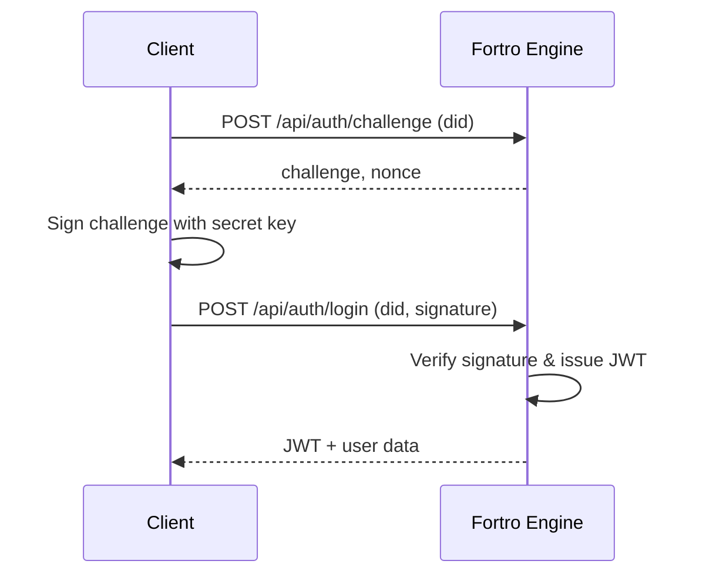

# Authentication
<Alert>
  Fortro Engine authentication combines seed-phrase derived keys, PIN-based local encryption, and DID-bound challenges. Always re-run OpenAPI generation after backend changes.
</Alert>

## Overview

Issuers and wallet holders bootstrap identity off-chain via a 12-word seed phrase. The seed is:

1. **Converted to Ed25519 (and Dilithium) key pairs** used to derive the DID (`did:alyra:*`).
2. **Hashed with PBKDF2-HMAC-SHA256** (salted, 100k iterations) to derive the `auth_token` sent to Fortro Engine during wallet/issuer creation.
3. **Encrypted with a user-chosen PIN** client-side before persisting in browser storage. Unlocking the session requires the correct PIN to decrypt, derive the auth token again, and authenticate.

Once authenticated, the backend issues a short-lived JWT, and the DID is bound to downstream requests. Credential offers generated by issuers include a **one-time challenge**; when the holder accepts an offer (scanning QR), the wallet signs that challenge with the unlocked key, proving DID ownership before issuing.



Headers for subsequent calls:

```http
Authorization: Bearer <jwt>
X-User-DID: did:alyra:...
```
