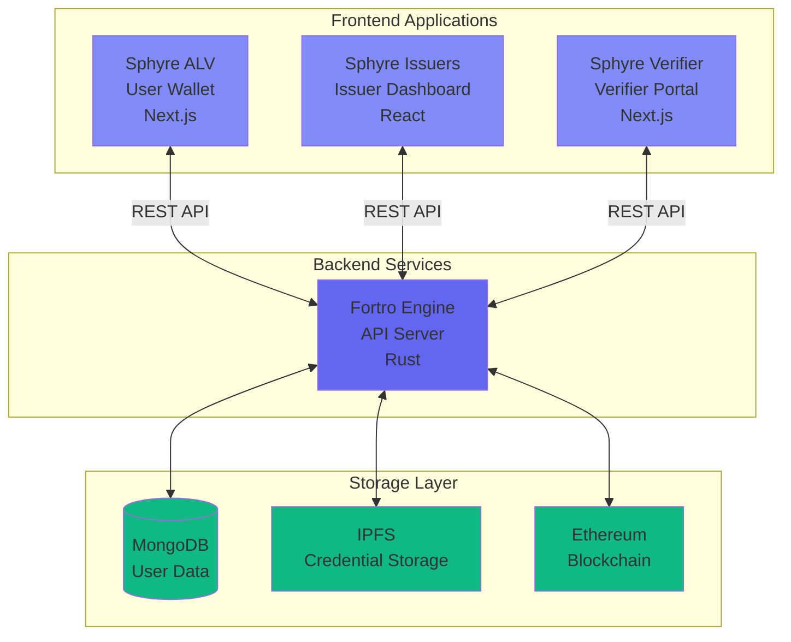
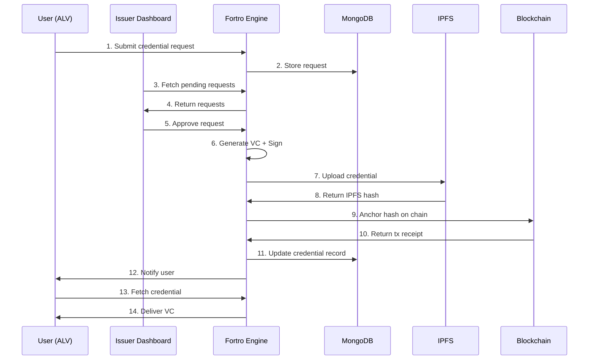
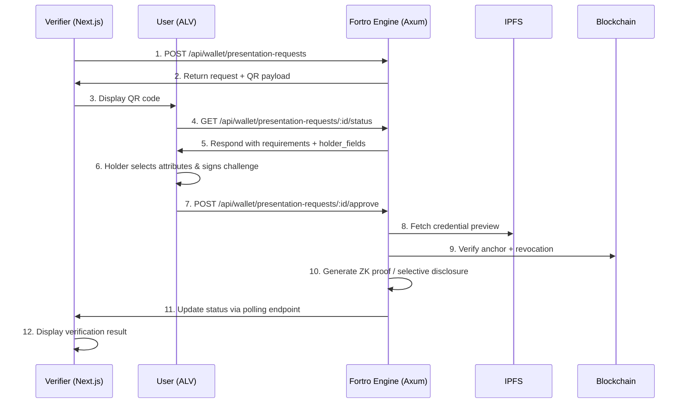
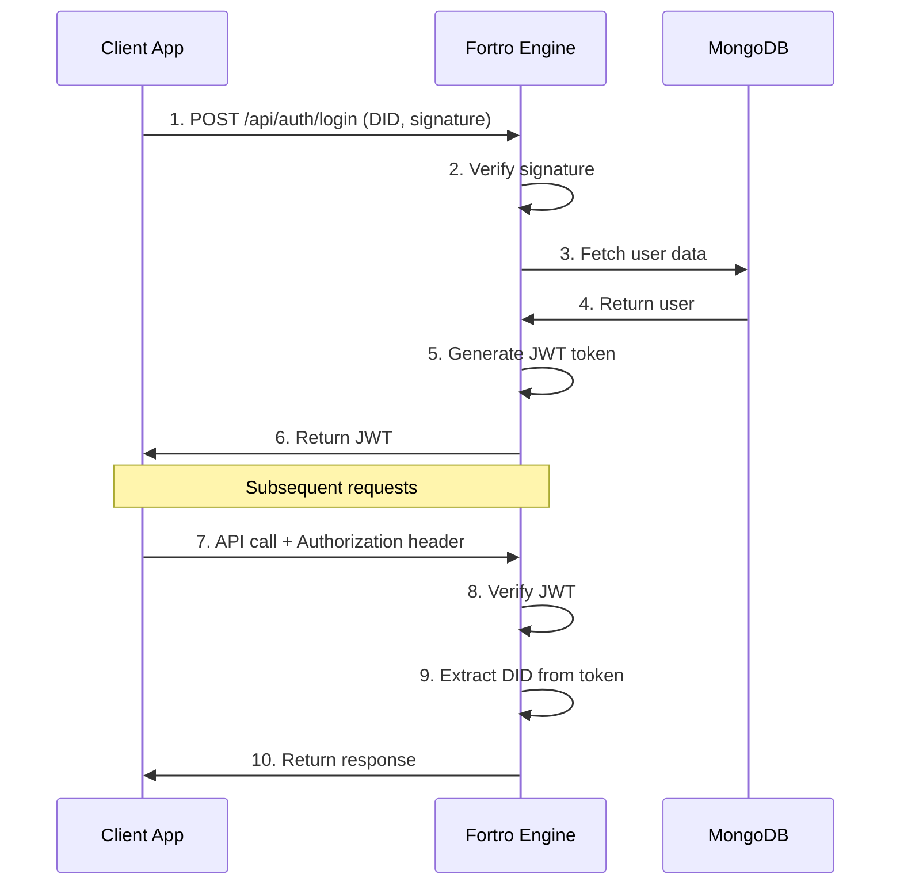

# System Architecture

Sphyre is built on a modular, decentralized architecture that separates concerns across multiple specialized applications. This design ensures scalability, security, and maintainability.

## High-Level Architecture



## Core Components

### 1. Fortro Engine (Backend API)

The central backend service that orchestrates all SSI operations.

**Technology Stack:**
- **Language:** Rust
- **Framework:** Axum (Tokio runtime)
- **Database:** MongoDB
- **Storage:** IPFS (Kubo)
- **Blockchain:** Ethereum (ethers-rs)
- **Messaging:** Async tasks via Tokio + `tower` middleware

**Key Features:**
- Modular Axum routers (`/api/auth`, `/api/wallet`, `/api/issuer`, `/api/verifier`, `/api/qr`, `/api/presentation-request`, `/api/consent`)
- Shared `AppState` for database, IPFS, and blockchain clients
- JWT-based authentication and DID extraction middleware
- Post-quantum cryptography (Kyber-Dilithium)
- Meta-transaction support (Minimal Forwarder)
- Automatic credential verification and presentation polling

**API Endpoints:**
```
/api/auth/*          - Authentication & registration
/api/wallet/*        - User wallet operations
/api/issuer/*        - Credential issuance
/api/verifier/*      - Verification requests
/api/qr/*            - QR code generation
```

<Card title="Learn More" icon="server" href="/components/fortro-engine">
  Detailed Fortro Engine documentation
</Card>

### 2. Sphyre ALV (User Wallet)

Progressive Web App for end-users to manage their digital identity.

**Technology Stack:**
- **Framework:** Next.js 14 (App Router)
- **Language:** TypeScript
- **Crypto:** tweetnacl, bip39
- **UI:** TailwindCSS, shadcn/ui

**Key Features:**
- 12-word seed phrase generation
- DID creation and management
- Credential storage and presentation
- QR code scanning
- Consent management
- Zero-knowledge proof generation
- Offline mode support

<Card title="Learn More" icon="wallet" href="/components/sphyre-alv">
  Detailed Sphyre ALV documentation
</Card>

### 3. Sphyre Issuers (Issuer Dashboard)

Web application for organizations to issue and manage credentials.

**Technology Stack:**
- **Framework:** React 18
- **Language:** TypeScript
- **State Management:** React Context
- **UI:** TailwindCSS, Material-UI

**Key Features:**
- Schema creation and management
- Template customization
- Credential issuance workflow
- Request approval system
- Credential revocation
- Analytics dashboard

<Card title="Learn More" icon="building" href="/components/sphyre-issuers">
  Detailed Sphyre Issuers documentation
</Card>

### 4. Sphyre Verifier (Verification Portal)

Application for organizations to request and verify credentials.

**Technology Stack:**
- **Framework:** Next.js 14
- **Language:** TypeScript
- **UI:** TailwindCSS, shadcn/ui

**Key Features:**
- Presentation request creation
- QR code generation for requests
- Credential verification
- Selective disclosure support
- Zero-knowledge proof verification
- Verification history

<Card title="Learn More" icon="check-circle" href="/components/sphyre-verifier">
  Detailed Sphyre Verifier documentation
</Card>

## Data Flow Architecture

### Credential Issuance Flow



### Credential Verification Flow



## Storage Architecture

### MongoDB Collections

```javascript
// credential_requests
{
  _id: ObjectId,
  request_id: "req-uuid",
  template_id: "template-id",
  issuer_did: "did:alyra:...",
  holder_did: "did:alyra:...",
  issuer_data: { ... },
  holder_data: { ... },
  status: "pending | approved | rejected",
  created_at: ISODate,
  updated_at: ISODate
}

// credentials
{
  _id: ObjectId,
  credential_id: "cred-uuid",
  holder_did: "did:alyra:...",
  issuer_did: "did:alyra:...",
  schema_id: "national-id-v1",
  template_id: "national-id-template",
  credential_preview: { ... },
  ipfs_hash: "Qm...",
  blockchain_tx_hash: "0x...",
  kyber_encrypted: true,
  kyber_secret_key: "hex...",
  status: "active|revoked",
  issued_at: ISODate,
  expires_at: ISODate
}

// presentation_requests
{
  _id: ObjectId,
  request_id: "pr-uuid",
  verifier_did: "did:alyra:...",
  required_credentials: [ ... ],
  status: "pending|approved|rejected|expired",
  presentation_data: { ... },
  updated_at: ISODate,
  expires_at: ISODate
}
```

### IPFS Storage

Credentials are stored on IPFS for decentralized, content-addressed storage:

```json
{
  "@context": ["https://www.w3.org/2018/credentials/v1"],
  "type": ["VerifiableCredential"],
  "issuer": "did:alyra:...",
  "issuanceDate": "2025-01-01T00:00:00Z",
  "credentialSubject": {
    "id": "did:alyra:...",
    "claims": { ... }
  },
  "proof": {
    "type": "Dilithium",
    "created": "2025-01-01T00:00:00Z",
    "proofPurpose": "assertionMethod",
    "verificationMethod": "did:alyra:...#keys-1",
    "signature": "base64_signature"
  }
}
```

### Blockchain Anchoring

Credential hashes are anchored on Ethereum for immutability:

```solidity
// Smart Contract Storage
mapping(bytes32 => CredentialAnchor) public anchors;

struct CredentialAnchor {
    bytes32 ipfsHash;
    address issuer;
    uint256 timestamp;
    bool revoked;
}
```

## Security Architecture

### Cryptographic Layer

<CardGroup cols={2}>
  <Card title="Post-Quantum Crypto" icon="atom">
    **Kyber** for key encapsulation  
    **Dilithium** for digital signatures  
    BBS+ for selective disclosure proofs
  </Card>
  
  <Card title="DID Generation" icon="key">
    Ed25519 key pair from seed phrase  
    `did:alyra:` + base64(publicKey)
  </Card>
  
  <Card title="Credential Signing" icon="signature">
    Issuer signs with Dilithium  
    Proof attached to credential
  </Card>
  
  <Card title="Zero-Knowledge Proofs" icon="shield-halved">
    Selective disclosure without revealing data  
    Age verification, citizenship, etc.
  </Card>
</CardGroup>

### Authentication Flow



## Network Architecture

### Deployment Topology

```
┌─────────────────────────────────────────┐
│           Load Balancer / CDN            │
└─────────────────────────────────────────┘
                    │
        ┌───────────┼───────────┬──────────┐
        │           │           │          │
┌───────▼──────┐ ┌─▼────────┐ ┌▼────────┐ │
│ app.sphyre   │ │ issuers. │ │verifier.│ │
│    .tech     │ │sphyre    │ │sphyre   │ │
│  (ALV App)   │ │.tech     │ │.tech    │ │
└──────────────┘ └──────────┘ └─────────┘ │
                                           │
                    ┌──────────────────────┘
                    │
        ┌───────────▼──────────┐
        │  api.sphyre.tech     │
        │   (Fortro Engine)    │
        └───────────┬──────────┘
                    │
    ┌───────────────┼────────────────┐
    │               │                │
┌───▼───┐    ┌─────▼─────┐   ┌─────▼────┐
│MongoDB│    │IPFS (Kubo)│   │ Ethereum │
│Database│   │   Node    │   │   Node   │
└───────┘    └───────────┘   └──────────┘
```

### API Communication

All frontend applications communicate with Fortro Engine via REST API:

**Base URL:** `https://api.sphyre.tech`

**Authentication:**
```http
Authorization: Bearer <JWT_TOKEN>
X-User-DID: did:alyra:...
X-Issuer-DID: did:alyra:... (for issuer flows)
```

**CORS Configuration:**
- Allowed origins: `https://app.sphyre.tech`, `https://issuers.sphyre.tech`, `https://verifier.sphyre.tech`, `https://sphyre.tech`
- Methods: GET, POST, PUT, DELETE, PATCH, OPTIONS
- Headers: Content-Type, Authorization, X-User-DID, X-Issuer-DID
- Credentials: `omit` (JWT sent via Authorization header)

## Performance & Scalability

### Optimization Strategies

<AccordionGroup>
  <Accordion icon="gauge-high" title="API Performance">
    - Rust's zero-cost abstractions for maximum speed
    - Async I/O with Tokio runtime
    - Connection pooling for database and IPFS
    - Response caching for frequently accessed data
  </Accordion>
  
  <Accordion icon="database" title="Database Optimization">
    - Indexed queries on DID and credential ID
    - Aggregation pipelines for analytics
    - TTL indexes for expired credentials
    - Sharding for horizontal scaling
  </Accordion>
  
  <Accordion icon="diagram-project" title="Frontend Optimization">
    - Next.js static generation where possible
    - Image optimization and lazy loading
    - Code splitting and tree shaking
    - Service worker for offline support
  </Accordion>
  
  <Accordion icon="network-wired" title="Network Optimization">
    - CDN for static assets
    - Gzip/Brotli compression
    - HTTP/2 multiplexing
    - WebSocket for real-time updates
  </Accordion>
</AccordionGroup>

## Design Principles

<Steps>
  <Step title="Decentralization">
    No single point of failure. Data distributed across IPFS and blockchain.
  </Step>
  
  <Step title="Privacy by Design">
    Minimal data collection. User controls data sharing. ZKP for selective disclosure.
  </Step>
  
  <Step title="Security First">
    Post-quantum cryptography, DID challenges, meta-transaction signer separation. Defense in depth. Regular security audits.
  </Step>
  
  <Step title="Interoperability">
    W3C standards compliance. OpenAPI specification. RESTful design.
  </Step>
  
  <Step title="User Experience">
    Simple interfaces. Progressive enhancement. Offline functionality.
  </Step>
</Steps>

## Technology Decisions

| Aspect | Technology | Rationale |
|--------|-----------|-----------|
| **Backend Language** | Rust + Axum + Tokio | Performance, memory safety, async concurrency |
| **Frontend Framework** | Next.js/React | Developer experience, SEO, SSR/SSG |
| **Database** | MongoDB | Flexible schema, JSON storage, scalability |
| **Storage** | IPFS (Kubo) | Decentralized, content-addressed, permanent |
| **Blockchain** | Ethereum (ethers-rs + Minimal Forwarder) | Smart contract + meta-tx support |
| **Cryptography** | Kyber, Dilithium, BBS+ | Post-quantum resistant, selective disclosure |
| **Authentication** | JWT + DID challenge | Stateless, DID-bound access |

## Migration Notes (Actix → Axum)

<Alert>
  Fortro Engine migrated from Actix-web to Axum/Tokio in 2025 to simplify middleware, state sharing, and async ergonomics. Key changes for developers upgrading older guides:
  - Replace `HttpServer::new`, `App::new`, and `web::Json` extractors with Axum `Router`, `IntoResponse`, and typed extractors (`Json<T>`, `Path<T>`, `State<AppState>`)
  - Configure middleware via `tower` layers (`TraceLayer`, `CorsLayer`, custom DID extractor)
  - Share dependencies (DB, IPFS, blockchain clients) through cloned `AppState`
  - Startup now uses `axum::serve` with `TcpListener` bound to port `3000`
  Ensure new code samples follow the Axum style. Older Actix snippets have been archived for reference only.
</Alert>

## Documentation Sync Checklist

- [ ] Update diagrams when new routes or services are added (wallet, issuer, verifier, meta-tx)
- [ ] Reflect changes to environment variables (`PORT`, `CORS_ALLOWED_ORIGINS`, blockchain addresses)
- [ ] Verify sample payloads match current MongoDB schemas (`credential_preview`, `presentation_requests`)
- [ ] Regenerate API reference after modifying Axum routers
- [ ] Confirm architecture pages mention new security features (challenge/response, meta transactions)
- [ ] Schedule quarterly review alongside backend release notes

## Next Steps

<CardGroup cols={2}>
  <Card
    title="Explore Components"
    icon="cubes"
    href="/components/fortro-engine"
  >
    Deep dive into each component
  </Card>
  
  <Card
    title="Developer Setup"
    icon="code"
    href="/developer/setup"
  >
    Set up local development environment
  </Card>
  
  <Card
    title="API Reference"
    icon="book"
    href="/api-reference/introduction"
  >
    Explore API endpoints
  </Card>
  
  <Card
    title="Core Concepts"
    icon="lightbulb"
    href="/concepts/ssi"
  >
    Understand SSI fundamentals
  </Card>
</CardGroup>
