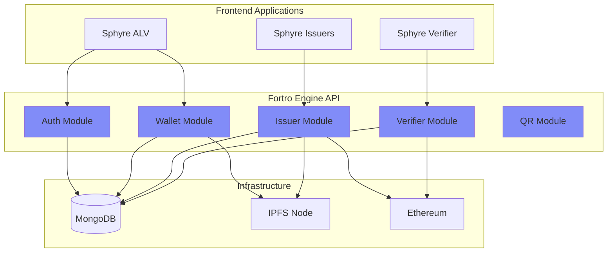

# Fortro Engine

Fortro Engine is the central backend API server that orchestrates all SSI operations in the Sphyre ecosystem. Built with Rust for maximum performance and security, it handles authentication, credential issuance, verification, and blockchain integration.

## Overview

**Fortro Engine** provides a RESTful API that connects all frontend applications with the underlying infrastructure (MongoDB, IPFS, Ethereum).

<CardGroup cols={2}>
  <Card title="Technology" icon="gear">
    **Language:** Rust  
    **Framework:** Actix-web  
    **Base URL:** `https://api.sphyre.tech`
  </Card>
  
  <Card title="Key Features" icon="star">
    Post-quantum cryptography  
    JWT authentication  
    IPFS & blockchain integration  
    Real-time credential processing
  </Card>
</CardGroup>

## Architecture



## Tech Stack

<AccordionGroup>
  <Accordion icon="rust" title="Rust Language">
    **Why Rust?**
    - Memory safety without garbage collection
    - Zero-cost abstractions
    - Fearless concurrency
    - Excellent performance
    
    **Version:** Rust 1.70+
  </Accordion>
  
  <Accordion icon="globe" title="Actix-web Framework">
    High-performance, async web framework for Rust
    
    ```toml
    [dependencies]
    actix-web = "4.4"
    actix-cors = "0.7"
    actix-rt = "2.9"
    ```
  </Accordion>
  
  <Accordion icon="database" title="MongoDB Driver">
    NoSQL database for flexible credential storage
    
    ```toml
    [dependencies]
    mongodb = "2.7"
    bson = "2.7"
    ```
  </Accordion>
  
  <Accordion icon="link" title="IPFS Integration">
    Decentralized storage via Kubo HTTP API
    
    ```toml
    [dependencies]
    ipfs-api = "0.17"
    ```
  </Accordion>
  
  <Accordion icon="ethereum" title="Ethereum Client">
    Blockchain interaction using ethers-rs
    
    ```toml
    [dependencies]
    ethers = "2.0"
    ```
  </Accordion>
  
  <Accordion icon="lock" title="Cryptography">
    Post-quantum and standard crypto libraries
    
    ```toml
    [dependencies]
    pqcrypto-dilithium = "0.5"
    pqcrypto-kyber = "0.7"
    ed25519-dalek = "2.0"
    sha2 = "0.10"
    ```
  </Accordion>
</AccordionGroup>

## Project Structure

```
fortro-engine/
├── src/
│   ├── main.rs                 # Entry point
│   ├── api/
│   │   ├── auth.rs            # Authentication endpoints
│   │   ├── wallet.rs          # Wallet management
│   │   ├── issuer.rs          # Credential issuance
│   │   ├── verifier.rs        # Verification endpoints
│   │   └── qr.rs              # QR code generation
│   ├── blockchain/
│   │   ├── client.rs          # Ethereum client
│   │   └── contracts.rs       # Smart contract interactions
│   ├── middleware/
│   │   ├── auth.rs            # JWT validation
│   │   └── cors.rs            # CORS configuration
│   ├── models/
│   │   ├── user.rs            # User data structures
│   │   ├── credential.rs      # Credential models
│   │   └── schema.rs          # Schema definitions
│   ├── services/
│   │   ├── crypto.rs          # Cryptographic operations
│   │   ├── ipfs.rs            # IPFS client
│   │   └── zkp.rs             # Zero-knowledge proofs
│   ├── db.rs                  # Database connection
│   ├── config.rs              # Configuration management
│   └── error.rs               # Error handling
├── tests/
│   ├── zkp_tests.rs           # ZKP unit tests
│   └── advanced_zkp_tests.rs  # Advanced ZKP tests
├── examples/
│   ├── test_blockchain_connection.rs
│   └── test_ipfs_connection.rs
└── Cargo.toml                 # Dependencies
```

## API Modules

### 1. Authentication Module

Handles user registration, login, and JWT token management.

**Endpoints:**
- `POST /api/auth/register` - Register new user with DID
- `POST /api/auth/login` - Authenticate with DID signature
- `POST /api/auth/verify` - Verify JWT token validity
- `GET /api/auth/challenge` - Get challenge for signature

**Example:**
```rust
pub async fn login(
    req: web::Json<LoginRequest>,
    db: web::Data<Database>
) -> Result<HttpResponse, AppError> {
    // Verify DID signature
    let public_key = extract_public_key_from_did(&req.did)?;
    verify_signature(&req.challenge, &req.signature, &public_key)?;
    
    // Generate JWT
    let token = generate_jwt(&req.did)?;
    
    Ok(HttpResponse::Ok().json(LoginResponse {
        token,
        did: req.did.clone()
    }))
}
```

### 2. Wallet Module

Manages user credentials and wallet operations.

**Endpoints:**
- `GET /api/wallet/:did/credentials` - Get all user credentials
- `GET /api/wallet/:did/connections` - Get user connections
- `POST /api/wallet/:did/consent` - Manage consent settings
- `GET /api/wallet/:did/credential/:id` - Get specific credential

**Features:**
- Real-time credential sync
- Offline data caching
- Consent management
- Connection tracking

### 3. Issuer Module

Handles credential schemas, templates, and issuance.

**Endpoints:**
- `POST /api/issuer/schema` - Create credential schema
- `GET /api/issuer/schemas` - List all schemas
- `POST /api/issuer/template` - Create credential template
- `POST /api/issuer/issue` - Issue verifiable credential
- `POST /api/issuer/revoke/:id` - Revoke credential
- `GET /api/issuer/requests` - Get pending credential requests

**Issuance Flow:**
```rust
pub async fn issue_credential(
    req: web::Json<IssueRequest>,
    db: web::Data<Database>,
    ipfs: web::Data<IpfsClient>,
    blockchain: web::Data<BlockchainClient>
) -> Result<HttpResponse, AppError> {
    // 1. Create credential
    let credential = create_verifiable_credential(req.into_inner())?;
    
    // 2. Sign with Dilithium
    let signature = sign_credential(&credential, &issuer_key)?;
    credential.proof = Some(signature);
    
    // 3. Upload to IPFS
    let ipfs_hash = ipfs.add_json(&credential).await?;
    
    // 4. Anchor on blockchain
    let tx_hash = blockchain.anchor_credential(&ipfs_hash).await?;
    
    // 5. Store in database
    db.store_credential(&credential, &ipfs_hash, &tx_hash).await?;
    
    Ok(HttpResponse::Ok().json(credential))
}
```

### 4. Verifier Module

Manages presentation requests and credential verification.

**Endpoints:**
- `POST /api/verifier/request` - Create presentation request
- `POST /api/verifier/verify` - Verify presentation
- `GET /api/verifier/verifications` - Get verification history
- `GET /api/verifier/request/:id` - Get request details

**Verification Process:**
```rust
pub async fn verify_presentation(
    req: web::Json<VerifyRequest>,
    blockchain: web::Data<BlockchainClient>
) -> Result<HttpResponse, AppError> {
    let presentation = &req.presentation;
    
    // 1. Verify holder signature
    verify_holder_signature(presentation)?;
    
    // 2. Verify each credential
    for credential in &presentation.verifiable_credentials {
        // Verify issuer signature
        verify_issuer_signature(credential)?;
        
        // Check blockchain anchor
        let is_anchored = blockchain
            .verify_anchor(&credential.ipfs_hash)
            .await?;
        
        // Check revocation status
        let is_revoked = blockchain
            .is_revoked(&credential.id)
            .await?;
        
        if !is_anchored || is_revoked {
            return Err(AppError::InvalidCredential);
        }
    }
    
    Ok(HttpResponse::Ok().json(VerificationResult {
        valid: true,
        verified_claims: extract_claims(presentation)
    }))
}
```

### 5. QR Code Module

Generates QR codes for credential offers and presentation requests.

**Endpoints:**
- `POST /api/qr/offer` - Generate credential offer QR
- `POST /api/qr/request` - Generate presentation request QR

## Database Schema

### MongoDB Collections

<Tabs>
  <Tab title="users">
    ```javascript
    {
      _id: ObjectId,
      did: "did:alyra:base64PublicKey...",
      publicKey: "base64String",
      email: "user@example.com",
      createdAt: ISODate("2024-01-01T00:00:00Z"),
      updatedAt: ISODate("2024-01-01T00:00:00Z"),
      walletData: {
        encryptedSeed: "...",
        preferences: {}
      }
    }
    ```
  </Tab>
  
  <Tab title="credentials">
    ```javascript
    {
      _id: ObjectId,
      id: "credential_unique_id",
      holderDid: "did:alyra:...",
      issuerDid: "did:alyra:...",
      schemaId: "national-id-v1",
      templateId: "gov-template-1",
      credentialSubject: {
        id: "did:alyra:...",
        claims: {
          fullName: "Alice Smith",
          dateOfBirth: "1990-01-01"
        }
      },
      ipfsHash: "QmX...",
      blockchainTxHash: "0x123...",
      proof: {
        type: "Dilithium",
        signature: "..."
      },
      status: "active", // or "revoked"
      issuedAt: ISODate,
      expiresAt: ISODate
    }
    ```
  </Tab>
  
  <Tab title="schemas">
    ```javascript
    {
      _id: ObjectId,
      id: "national-id-v1",
      name: "National ID",
      version: "1.0",
      description: "Government ID credential",
      fields: [
        {
          name: "fullName",
          type: "string",
          required: true
        },
        {
          name: "dateOfBirth",
          type: "date",
          required: true
        }
      ],
      issuerDid: "did:alyra:...",
      createdAt: ISODate
    }
    ```
  </Tab>
  
  <Tab title="templates">
    ```javascript
    {
      _id: ObjectId,
      id: "template_id",
      schemaId: "national-id-v1",
      name: "Government National ID",
      description: "Official government template",
      issuerDid: "did:alyra:...",
      issuerName: "Government Agency",
      design: {
        backgroundColor: "#1E40AF",
        logo: "ipfs://Qm..."
      },
      createdAt: ISODate
    }
    ```
  </Tab>
</Tabs>

## Cryptographic Operations

### Post-Quantum Cryptography

Fortro Engine uses NIST-approved post-quantum algorithms:

```rust
use pqcrypto_dilithium::dilithium2;
use pqcrypto_kyber::kyber768;

// Key generation
pub fn generate_pq_keypair() -> (PublicKey, SecretKey) {
    dilithium2::keypair()
}

// Signing
pub fn sign_with_dilithium(
    message: &[u8],
    secret_key: &SecretKey
) -> Signature {
    dilithium2::sign(message, secret_key)
}

// Verification
pub fn verify_dilithium(
    message: &[u8],
    signature: &Signature,
    public_key: &PublicKey
) -> bool {
    dilithium2::verify(signature, message, public_key).is_ok()
}
```

### DID Operations

```rust
pub fn create_did_from_public_key(public_key: &[u8]) -> String {
    let encoded = base64::encode(public_key);
    format!("did:alyra:{}", encoded)
}

pub fn extract_public_key_from_did(did: &str) -> Result<Vec<u8>> {
    let parts: Vec<&str> = did.split(':').collect();
    if parts.len() != 3 || parts[0] != "did" || parts[1] != "alyra" {
        return Err(AppError::InvalidDID);
    }
    base64::decode(parts[2])
        .map_err(|_| AppError::InvalidDID)
}
```

## IPFS Integration

### Upload Credentials

```rust
use ipfs_api::IpfsClient;

pub async fn upload_to_ipfs(
    credential: &VerifiableCredential
) -> Result<String> {
    let client = IpfsClient::default();
    let data = serde_json::to_vec(credential)?;
    
    let response = client
        .add(Cursor::new(data))
        .await?;
    
    Ok(response.hash)
}
```

### Retrieve Credentials

```rust
pub async fn get_from_ipfs(hash: &str) -> Result<VerifiableCredential> {
    let client = IpfsClient::default();
    let data = client
        .cat(hash)
        .map_ok(|chunk| chunk.to_vec())
        .try_concat()
        .await?;
    
    serde_json::from_slice(&data)
        .map_err(|e| AppError::IpfsError(e.to_string()))
}
```

## Blockchain Integration

### Smart Contract Interaction

```rust
use ethers::prelude::*;

pub async fn anchor_credential(
    ipfs_hash: &str,
    credential_id: &str
) -> Result<TransactionReceipt> {
    let contract = get_contract().await?;
    
    let tx = contract
        .anchor_credential(
            ipfs_hash.as_bytes().into(),
            credential_id.as_bytes().into()
        )
        .send()
        .await?
        .await?;
    
    Ok(tx.unwrap())
}

pub async fn verify_anchor(ipfs_hash: &str) -> Result<bool> {
    let contract = get_contract().await?;
    
    let exists: bool = contract
        .verify_anchor(ipfs_hash.as_bytes().into())
        .call()
        .await?;
    
    Ok(exists)
}

pub async fn revoke_credential(credential_id: &str) -> Result<()> {
    let contract = get_contract().await?;
    
    contract
        .revoke_credential(credential_id.as_bytes().into())
        .send()
        .await?
        .await?;
    
    Ok(())
}
```

## Error Handling

Fortro Engine uses a centralized error handling system:

```rust
#[derive(Debug)]
pub enum AppError {
    DatabaseError(mongodb::error::Error),
    InvalidDID,
    InvalidSignature,
    UnauthorizedError,
    CredentialNotFound,
    IpfsError(String),
    BlockchainError(String),
    ValidationError(String),
}

impl ResponseError for AppError {
    fn error_response(&self) -> HttpResponse {
        match self {
            AppError::UnauthorizedError => {
                HttpResponse::Unauthorized().json(json!({
                    "error": "Unauthorized"
                }))
            }
            AppError::CredentialNotFound => {
                HttpResponse::NotFound().json(json!({
                    "error": "Credential not found"
                }))
            }
            _ => {
                HttpResponse::InternalServerError().json(json!({
                    "error": "Internal server error"
                }))
            }
        }
    }
}
```

## Configuration

Environment variables for Fortro Engine:

```bash
# Server
PORT=8080
HOST=0.0.0.0

# Database
MONGODB_URI=mongodb://localhost:27017
MONGODB_DATABASE=sphyre

# IPFS
IPFS_API_URL=http://localhost:5001

# Ethereum
ETH_RPC_URL=https://mainnet.infura.io/v3/YOUR_KEY
CONTRACT_ADDRESS=0x123...
PRIVATE_KEY=0xabc...

# JWT
JWT_SECRET=your-secret-key
JWT_EXPIRATION=86400

# CORS
ALLOWED_ORIGINS=https://app.sphyre.tech,https://issuers.sphyre.tech
```

## Deployment

### Docker Deployment

```dockerfile
FROM rust:1.70 as builder
WORKDIR /app
COPY . .
RUN cargo build --release

FROM debian:bullseye-slim
COPY --from=builder /app/target/release/fortro-engine /usr/local/bin/
EXPOSE 8080
CMD ["fortro-engine"]
```

### Docker Compose

```yaml
version: '3.8'
services:
  fortro-engine:
    build: .
    ports:
      - "8080:8080"
    environment:
      - MONGODB_URI=mongodb://mongo:27017
      - IPFS_API_URL=http://ipfs:5001
    depends_on:
      - mongo
      - ipfs
  
  mongo:
    image: mongo:6
    volumes:
      - mongo-data:/data/db
  
  ipfs:
    image: ipfs/kubo:latest
    ports:
      - "5001:5001"
    volumes:
      - ipfs-data:/data/ipfs

volumes:
  mongo-data:
  ipfs-data:
```

## Testing

### Unit Tests

```rust
#[cfg(test)]
mod tests {
    use super::*;
    
    #[test]
    fn test_did_generation() {
        let public_key = vec![1, 2, 3, 4];
        let did = create_did_from_public_key(&public_key);
        assert!(did.starts_with("did:alyra:"));
    }
    
    #[actix_rt::test]
    async fn test_credential_issuance() {
        let app = test::init_service(
            App::new().service(issue_credential)
        ).await;
        
        let req = test::TestRequest::post()
            .uri("/api/issuer/issue")
            .set_json(&issue_request)
            .to_request();
        
        let resp = test::call_service(&app, req).await;
        assert_eq!(resp.status(), 200);
    }
}
```

## Performance Optimization

<AccordionGroup>
  <Accordion icon="gauge-high" title="Connection Pooling">
    Reuse database and IPFS connections
    
    ```rust
    let pool = MongoClient::with_options(
        ClientOptions::builder()
            .max_pool_size(100)
            .build()
    )?;
    ```
  </Accordion>
  
  <Accordion icon="bolt" title="Async Operations">
    Non-blocking I/O with Tokio runtime
    
    ```rust
    #[actix_web::main]
    async fn main() {
        HttpServer::new(|| App::new())
            .workers(4)
            .bind("0.0.0.0:8080")?
            .run()
            .await
    }
    ```
  </Accordion>
  
  <Accordion icon="memory" title="Caching">
    Cache frequently accessed data
    
    ```rust
    lazy_static! {
        static ref SCHEMA_CACHE: Mutex<HashMap<String, Schema>> 
            = Mutex::new(HashMap::new());
    }
    ```
  </Accordion>
</AccordionGroup>

## Monitoring & Logging

```rust
use tracing::{info, error, warn};

#[actix_web::main]
async fn main() {
    tracing_subscriber::fmt::init();
    
    info!("Starting Fortro Engine on port 8080");
    
    HttpServer::new(|| {
        App::new()
            .wrap(Logger::default())
            .service(api_routes())
    })
    .bind("0.0.0.0:8080")?
    .run()
    .await
}
```

## Resources

<CardGroup cols={2}>
  <Card
    title="API Documentation"
    icon="book"
    href="/api-reference/introduction"
  >
    Complete API reference
  </Card>
  
  <Card
    title="GitHub Repository"
    icon="github"
    href="https://github.com/sphyre/fortro-engine"
  >
    Source code and issues
  </Card>
  
  <Card
    title="Developer Setup"
    icon="code"
    href="/developer/setup"
  >
    Local development guide
  </Card>
  
  <Card
    title="Deployment Guide"
    icon="server"
    href="/developer/deployment"
  >
    Production deployment
  </Card>
</CardGroup>
