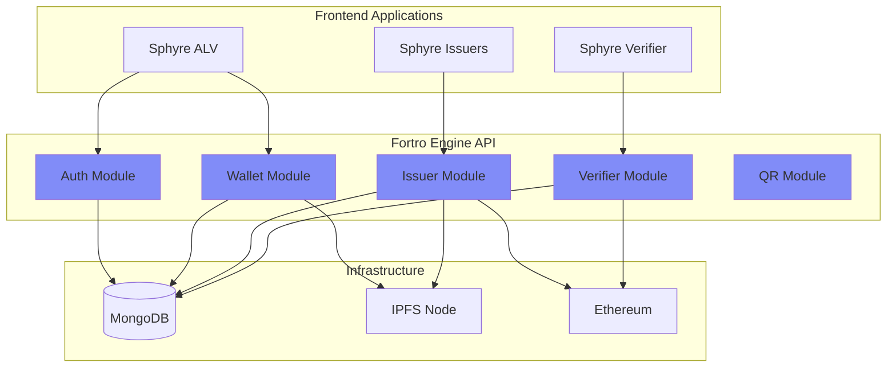

# Fortro Engine

Fortro Engine is the central backend API server that orchestrates all SSI operations in the Sphyre ecosystem. Built with Rust for maximum performance and security, it handles authentication, credential issuance, verification, and blockchain integration.

## Overview

**Fortro Engine** provides a RESTful API that connects all frontend applications with the underlying infrastructure (MongoDB, IPFS, Ethereum).

<CardGroup cols={2}>
  <Card title="Technology" icon="gear">
    **Language:** Rust  
    **Framework:** Axum (Tokio runtime)  
    **Base URL:** `https://api.sphyre.tech`
  </Card>
  
  <Card title="Key Features" icon="star">
    Post-quantum cryptography  
    JWT authentication  
    IPFS & blockchain integration  
    Real-time credential processing
  </Card>
</CardGroup>

## Architecture



## Tech Stack

<AccordionGroup>
  <Accordion icon="rust" title="Rust Language">
    **Why Rust?**
    - Memory safety without garbage collection
    - Zero-cost abstractions
    - Fearless concurrency
    - Excellent performance
    
    **Version:** Rust 1.70+
  </Accordion>
  
  <Accordion icon="globe" title="Axum Web Framework">
    Tower-based async HTTP stack backed by the Tokio runtime.
    
    ```toml
    [dependencies]
    axum = "0.7"
    tower = "0.4"
    tower-http = { version = "0.5", features = ["cors", "trace"] }
    tokio = { version = "1.37", features = ["full"] }
    ```
  </Accordion>
  
  <Accordion icon="database" title="MongoDB Driver">
    NoSQL database for flexible credential storage
    
    ```toml
    [dependencies]
    mongodb = "2.7"
    bson = "2.7"
    ```
  </Accordion>
  
  <Accordion icon="link" title="IPFS Integration">
    Decentralized storage via Kubo HTTP API
    
    ```toml
    [dependencies]
    ipfs-api = "0.17"
    ```
  </Accordion>
  
  <Accordion icon="ethereum" title="Ethereum Client">
    Blockchain interaction using ethers-rs
    
    ```toml
    [dependencies]
    ethers = "2.0"
    ```
  </Accordion>
  
  <Accordion icon="lock" title="Cryptography">
    Post-quantum and standard crypto libraries
    
    ```toml
    [dependencies]
    pqcrypto-dilithium = "0.5"
    pqcrypto-kyber = "0.7"
    ed25519-dalek = "2.0"
    sha2 = "0.10"
    ```
  </Accordion>
</AccordionGroup>

## Project Structure

```
fortro-engine/
├── src/
│   ├── main.rs                 # Axum bootstrap & middleware
│   ├── api/
│   │   ├── auth.rs            # Authentication routes
│   │   ├── wallet.rs          # Wallet + presentation flows
│   │   ├── issuer.rs          # Issuance routes
│   │   ├── verifier.rs        # Verification routes
│   │   ├── qr.rs              # QR + short URL generation
│   │   ├── presentation_request.rs
│   │   ├── credential_request.rs
│   │   └── consent.rs
│   ├── blockchain/            # Smart-contract client & ABI helpers
│   ├── middleware/            # DID extraction, auth guards
│   ├── models.rs              # Domain structs & enums
│   ├── services/              # Business logic (credential, issuer, wallet)
│   ├── utils/                 # Crypto, DID compatibility, helpers
│   ├── db.rs                  # Mongo connection + repository helpers
│   ├── config.rs              # Environment configuration loader
│   └── error.rs               # Unified error type (AppError)
├── Cargo.toml                 # Dependencies
└── README.md / docs           # Developer notes
```

## API Modules

### 1. Authentication Module

Handles user registration, login, and JWT token management.

**Endpoints:**
- `POST /api/auth/register` - Register new user with DID
- `POST /api/auth/login` - Authenticate with DID signature
- `POST /api/auth/verify` - Verify JWT token validity
- `GET /api/auth/challenge` - Get challenge for signature

**Example:**
```rust
pub async fn login(
    State(state): State<AppState>,
    Json(payload): Json<LoginRequest>,
) -> Result<Json<LoginResponse>, AppError> {
    let public_key = utils::did::extract_public_key(&payload.did)?;
    utils::crypto::verify_signature(
        payload.challenge.as_bytes(),
        &payload.signature,
        &public_key,
    )?;

    let token = state.auth_service().issue_jwt(&payload.did)?;

    Ok(Json(LoginResponse {
        token,
        did: payload.did,
    }))
}
```

### 2. Wallet Module

Manages user credentials and wallet operations.

**Endpoints:**
- `GET /api/wallet/:did/credentials` - Get all user credentials
- `GET /api/wallet/:did/connections` - Get user connections
- `POST /api/wallet/:did/consent` - Manage consent settings
- `GET /api/wallet/:did/credential/:id` - Get specific credential

**Features:**
- Real-time credential sync
- Offline data caching
- Consent management
- Connection tracking

### 3. Issuer Module

Handles credential schemas, templates, and issuance.

**Endpoints:**
- `POST /api/issuer/schema` - Create credential schema
- `GET /api/issuer/schemas` - List all schemas
- `POST /api/issuer/template` - Create credential template
- `POST /api/issuer/issue` - Issue verifiable credential
- `POST /api/issuer/revoke/:id` - Revoke credential
- `GET /api/issuer/requests` - Get pending credential requests

**Issuance Flow:**
```rust
pub async fn issue_credential(
    State(state): State<AppState>,
    Json(request): Json<IssueCredentialRequest>,
) -> Result<Json<IssueCredentialResponse>, AppError> {
    let issuer_service = state.issuer_service();
    let credential_service = state.credential_service();

    let (credential, ipfs_hash, tx_hash) = credential_service
        .issue_from_request(&request)
        .await?;

    issuer_service
        .record_issuance(&credential, &ipfs_hash, tx_hash.as_ref())
        .await?;

    Ok(Json(IssueCredentialResponse {
        credential,
        ipfs_hash,
        blockchain_tx_hash: tx_hash,
    }))
}
```

### 4. Verifier Module

Manages presentation requests and credential verification.

**Endpoints:**
- `POST /api/verifier/request` - Create presentation request
- `POST /api/verifier/verify` - Verify presentation
- `GET /api/verifier/verifications` - Get verification history
- `GET /api/verifier/request/:id` - Get request details

**Verification Process:**
```rust
pub async fn verify_presentation(
    req: web::Json<VerifyRequest>,
    blockchain: web::Data<BlockchainClient>
) -> Result<HttpResponse, AppError> {
    let presentation = &req.presentation;
    
    // 1. Verify holder signature
    verify_holder_signature(presentation)?;
    
    // 2. Verify each credential
    for credential in &presentation.verifiable_credentials {
        // Verify issuer signature
        verify_issuer_signature(credential)?;
        
        // Check blockchain anchor
        let is_anchored = blockchain
            .verify_anchor(&credential.ipfs_hash)
            .await?;
        
        // Check revocation status
        let is_revoked = blockchain
            .is_revoked(&credential.id)
            .await?;
        
        if !is_anchored || is_revoked {
            return Err(AppError::InvalidCredential);
        }
    }
    
    Ok(HttpResponse::Ok().json(VerificationResult {
        valid: true,
        verified_claims: extract_claims(presentation)
    }))
}
```

### 5. QR Code Module

Generates QR codes for credential offers and presentation requests.

**Endpoints:**
- `POST /api/qr/offer` - Generate credential offer QR
- `POST /api/qr/request` - Generate presentation request QR

## Database Schema

### MongoDB Collections

<Tabs>
  <Tab title="users">
    ```javascript
    {
      _id: ObjectId,
      did: "did:alyra:base64PublicKey...",
      publicKey: "base64String",
      email: "user@example.com",
      createdAt: ISODate("2024-01-01T00:00:00Z"),
      updatedAt: ISODate("2024-01-01T00:00:00Z"),
      walletData: {
        encryptedSeed: "...",
        preferences: {}
      }
    }
    ```
  </Tab>
  
  <Tab title="credentials">
    ```javascript
    {
      _id: ObjectId,
      id: "credential_unique_id",
      holderDid: "did:alyra:...",
      issuerDid: "did:alyra:...",
      schemaId: "national-id-v1",
      templateId: "gov-template-1",
      credentialSubject: {
        id: "did:alyra:...",
        claims: {
          fullName: "Alice Smith",
          dateOfBirth: "1990-01-01"
        }
      },
      ipfsHash: "QmX...",
      blockchainTxHash: "0x123...",
      proof: {
        type: "Dilithium",
        signature: "..."
      },
      status: "active", // or "revoked"
      issuedAt: ISODate,
      expiresAt: ISODate
    }
    ```
  </Tab>
  
  <Tab title="schemas">
    ```javascript
    {
      _id: ObjectId,
      id: "national-id-v1",
      name: "National ID",
      version: "1.0",
      description: "Government ID credential",
      fields: [
        {
          name: "fullName",
          type: "string",
          required: true
        },
        {
          name: "dateOfBirth",
          type: "date",
          required: true
        }
      ],
      issuerDid: "did:alyra:...",
      createdAt: ISODate
    }
    ```
  </Tab>
  
  <Tab title="templates">
    ```javascript
    {
      _id: ObjectId,
      id: "template_id",
      schemaId: "national-id-v1",
      name: "Government National ID",
      description: "Official government template",
      issuerDid: "did:alyra:...",
      issuerName: "Government Agency",
      design: {
        backgroundColor: "#1E40AF",
        logo: "ipfs://Qm..."
      },
      createdAt: ISODate
    }
    ```
  </Tab>
</Tabs>

## Cryptographic Operations

### Post-Quantum Cryptography

Fortro Engine uses NIST-approved post-quantum algorithms:

```rust
use pqcrypto_dilithium::dilithium2;
use pqcrypto_kyber::kyber768;

// Key generation
pub fn generate_pq_keypair() -> (PublicKey, SecretKey) {
    dilithium2::keypair()
}

// Signing
pub fn sign_with_dilithium(
    message: &[u8],
    secret_key: &SecretKey
) -> Signature {
    dilithium2::sign(message, secret_key)
}

// Verification
pub fn verify_dilithium(
    message: &[u8],
    signature: &Signature,
    public_key: &PublicKey
) -> bool {
    dilithium2::verify(signature, message, public_key).is_ok()
}
```

### DID Operations

```rust
pub fn create_did_from_public_key(public_key: &[u8]) -> String {
    let encoded = base64::encode(public_key);
    format!("did:alyra:{}", encoded)
}

pub fn extract_public_key_from_did(did: &str) -> Result<Vec<u8>> {
    let parts: Vec<&str> = did.split(':').collect();
    if parts.len() != 3 || parts[0] != "did" || parts[1] != "alyra" {
        return Err(AppError::InvalidDID);
    }
    base64::decode(parts[2])
        .map_err(|_| AppError::InvalidDID)
}
```

## IPFS Integration

### Upload Credentials

```rust
use ipfs_api::IpfsClient;

pub async fn upload_to_ipfs(
    credential: &VerifiableCredential
) -> Result<String> {
    let client = IpfsClient::default();
    let data = serde_json::to_vec(credential)?;
    
    let response = client
        .add(Cursor::new(data))
        .await?;
    
    Ok(response.hash)
}
```

### Retrieve Credentials

```rust
pub async fn get_from_ipfs(hash: &str) -> Result<VerifiableCredential> {
    let client = IpfsClient::default();
    let data = client
        .cat(hash)
        .map_ok(|chunk| chunk.to_vec())
        .try_concat()
        .await?;
    
    serde_json::from_slice(&data)
        .map_err(|e| AppError::IpfsError(e.to_string()))
}
```

## Blockchain Integration

### Smart Contract Interaction

```rust
use ethers::prelude::*;

pub async fn anchor_credential(
    ipfs_hash: &str,
    credential_id: &str
) -> Result<TransactionReceipt> {
    let contract = get_contract().await?;
    
    let tx = contract
        .anchor_credential(
            ipfs_hash.as_bytes().into(),
            credential_id.as_bytes().into()
        )
        .send()
        .await?
        .await?;
    
    Ok(tx.unwrap())
}

pub async fn verify_anchor(ipfs_hash: &str) -> Result<bool> {
    let contract = get_contract().await?;
    
    let exists: bool = contract
        .verify_anchor(ipfs_hash.as_bytes().into())
        .call()
        .await?;
    
    Ok(exists)
}

pub async fn revoke_credential(credential_id: &str) -> Result<()> {
    let contract = get_contract().await?;
    
    contract
        .revoke_credential(credential_id.as_bytes().into())
        .send()
        .await?
        .await?;
    
    Ok(())
}
```

## Error Handling

Fortro Engine uses a centralized error handling system:

```rust
#[derive(Debug)]
pub enum AppError {
    DatabaseError(mongodb::error::Error),
    InvalidDID,
    InvalidSignature,
    UnauthorizedError,
    CredentialNotFound,
    IpfsError(String),
    BlockchainError(String),
    ValidationError(String),
}

impl ResponseError for AppError {
    fn error_response(&self) -> HttpResponse {
        match self {
            AppError::UnauthorizedError => {
                HttpResponse::Unauthorized().json(json!({
                    "error": "Unauthorized"
                }))
            }
            AppError::CredentialNotFound => {
                HttpResponse::NotFound().json(json!({
                    "error": "Credential not found"
                }))
            }
            _ => {
                HttpResponse::InternalServerError().json(json!({
                    "error": "Internal server error"
                }))
            }
        }
    }
}
```

## Configuration

Environment variables for Fortro Engine:

```bash
# Core server
PORT=3000
HOST=0.0.0.0
JWT_SECRET=your-secret-key
JWT_EXPIRATION=86400

# Database
MONGODB_URI=mongodb://mongo:27017/fortro_db
DATABASE_NAME=fortro_db

# IPFS
IPFS_API_URL=http://ipfs:5001
IPFS_GATEWAY=https://gateway.sphyre.tech

# Blockchain
ETHEREUM_RPC_URL=https://sepolia.base.org
BLOCKCHAIN_RPC_URL=https://sepolia.base.org
BLOCKCHAIN_CHAIN_ID=84532
BLOCKCHAIN_DEPLOYER_PRIVATE_KEY=0x...
SSI_REGISTRY_ADDRESS=0x...
MINIMAL_FORWARDER_ADDRESS=0x...
SSI_FACTORY_ADDRESS=0x...

# Issuer identity
ISSUER_DID=did:alyra:...
ISSUER_PRIVATE_KEY=0x...

# CORS
CORS_ALLOWED_ORIGINS=https://app.sphyre.tech,https://verifier.sphyre.tech,https://issuers.sphyre.tech,https://sphyre.tech
```

## Deployment

### Docker Deployment

```dockerfile
FROM rust:1.74 as builder
WORKDIR /app
COPY . .
RUN cargo build --release

FROM debian:bookworm-slim
COPY --from=builder /app/target/release/fortro-engine /usr/local/bin/
ENV RUST_LOG=info
EXPOSE 3000
CMD ["fortro-engine"]
```

### Docker Compose

```yaml
version: '3.8'
services:
  fortro-engine:
    build: .
    ports:
      - "3000:3000"
    environment:
      MONGODB_URI: mongodb://mongo:27017/fortro_db
      IPFS_API_URL: http://ipfs:5001
      CORS_ALLOWED_ORIGINS: https://app.sphyre.tech,https://verifier.sphyre.tech
    depends_on:
      - mongo
      - ipfs
  
  mongo:
    image: mongo:6
    volumes:
      - mongo-data:/data/db
  
  ipfs:
    image: ipfs/kubo:latest
    ports:
      - "5001:5001"
    volumes:
      - ipfs-data:/data/ipfs

volumes:
  mongo-data:
  ipfs-data:
```

## Testing

### Unit Tests

```rust
#[cfg(test)]
mod tests {
    use super::*;
    
    #[test]
    fn test_did_generation() {
        let public_key = vec![1, 2, 3, 4];
        let did = create_did_from_public_key(&public_key);
        assert!(did.starts_with("did:alyra:"));
    }
    
    #[tokio::test]
    async fn test_wallet_service_merges_holder_data() {
        let state = TestHarness::new().await;
        let request = mock_credential_request();
        let response = state
            .wallet_service()
            .merge_holder_inputs(&request)
            .await
            .unwrap();

        assert!(response.credential_preview.is_object());
    }
}
```

## Performance Optimization

<AccordionGroup>
  <Accordion icon="gauge-high" title="Connection Pooling">
    Reuse database and IPFS connections
    
    ```rust
    let pool = MongoClient::with_options(
        ClientOptions::builder()
            .max_pool_size(100)
            .build()
    )?;
    ```
  </Accordion>
  
  <Accordion icon="bolt" title="Async Operations">
    Non-blocking I/O with Tokio runtime
    
    ```rust
    use axum::{routing::get, Router};
    use tokio::net::TcpListener;

    #[tokio::main(flavor = "current_thread")]
    async fn main() -> Result<(), Box<dyn std::error::Error>> {
        let state = build_app_state().await?;

        let app = Router::new()
            .route("/api/health", get(health_handler))
            .with_state(state.clone());

        // Spawn background task (e.g., refresh presentation cache)
        tokio::spawn(async move {
            if let Err(err) = refresh_presentation_cache(state).await {
                tracing::warn!("cache refresh failed: {err}");
            }
        });

        axum::serve(TcpListener::bind("0.0.0.0:3000").await?, app.into_make_service()).await?;
        Ok(())
    }
    ```
  </Accordion>
  
  <Accordion icon="memory" title="Caching">
    Cache frequently accessed data
    
    ```rust
    lazy_static! {
        static ref SCHEMA_CACHE: Mutex<HashMap<String, Schema>> 
            = Mutex::new(HashMap::new());
    }
    ```
  </Accordion>
</AccordionGroup>

## Monitoring & Logging

```rust
use tracing::{info, warn};
use tower_http::trace::TraceLayer;

#[tokio::main(flavor = "current_thread")]
async fn main() -> Result<(), Box<dyn std::error::Error>> {
    tracing_subscriber::fmt::init();

    let state = build_app_state().await?;

    let app = Router::new()
        .nest("/api", api::routes())
        .layer(TraceLayer::new_for_http())
        .layer(axum_middleware::from_fn_with_state(
            state.clone(),
            middleware::extract_user_did,
        ))
        .with_state(state);

    info!("Starting Fortro Engine on port 3000");

    axum::serve(
        TcpListener::bind("0.0.0.0:3000").await?,
        app.into_make_service(),
    )
    .await?;

    Ok(())
}
```

## Resources

<CardGroup cols={2}>
  <Card
    title="API Documentation"
    icon="book"
    href="/api-reference/introduction"
  >
    Complete API reference
  </Card>
  
  <Card
    title="GitHub Repository"
    icon="github"
    href="https://github.com/sphyre/fortro-engine"
  >
    Source code and issues
  </Card>
  
  <Card
    title="Developer Setup"
    icon="code"
    href="/developer/setup"
  >
    Local development guide
  </Card>
  
  <Card
    title="Deployment Guide"
    icon="server"
    href="/developer/deployment"
  >
    Production deployment
  </Card>
</CardGroup>
