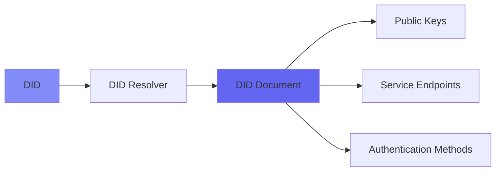
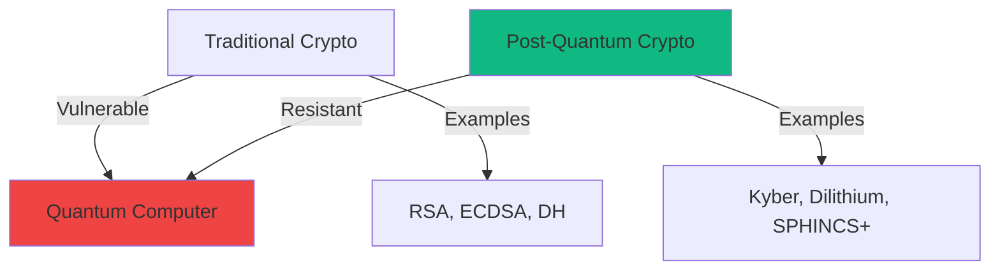
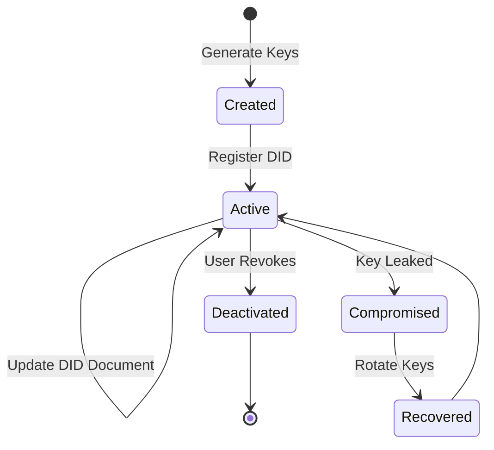

# Decentralized Identifiers (DIDs)

A Decentralized Identifier (DID) is a new type of identifier that enables verifiable, self-sovereign digital identity. DIDs are fully under the control of the DID subject, independent from any centralized registry, identity provider, or certificate authority.

## What is a DID?

A DID is a unique identifier that:
- You create yourself (no central authority needed)
- You own and control completely
- Is cryptographically verifiable
- Works across different systems and platforms
- Persists independently of any organization

<Info>
  Think of a DID like your email address, but you own it completely, it's cryptographically secure, and no company can take it away from you.
</Info>

## DID Structure

DIDs follow a standard format defined by W3C:

```
did:method:method-specific-identifier
```

### Sphyre's DID Method: `did:alyra`

Sphyre uses the `did:alyra` method with post-quantum cryptography:

```
did:alyra:MFkwEwYHKoZIzj0CAQYIKoZIzj0DAQcDQgAE...
         └─────────────────┬─────────────────┘
              base64-encoded public key
```

**Components:**
- **Scheme:** `did` - Identifies this as a DID
- **Method:** `alyra` - Sphyre's DID method
- **Identifier:** Base64-encoded public key from your wallet

## How DIDs Work

### DID Creation

When you create a wallet in Sphyre:

<Steps>
  <Step title="Generate Seed Phrase">
    A 12-word BIP39 seed phrase is generated
    
    ```
    abandon ability able about above absent absorb abstract absurd abuse access accident
    ```
  </Step>
  
  <Step title="Derive Key Pair">
    Ed25519 key pair is derived from the seed phrase
    
    ```javascript
    const seed = mnemonicToSeedSync(mnemonic);
    const keyPair = nacl.sign.keyPair.fromSeed(seed.slice(0, 32));
    ```
  </Step>
  
  <Step title="Create DID">
    Public key is encoded in base64 to form the DID
    
    ```javascript
    const did = `did:alyra:${base64Encode(keyPair.publicKey)}`;
    ```
  </Step>
  
  <Step title="Register (Optional)">
    DID can be registered in Sphyre's registry for discovery
  </Step>
</Steps>

### DID Resolution

To verify or use a DID, it must be "resolved" to get the associated public key and metadata:



## DID Document

When a DID is resolved, it returns a DID Document containing:

```json
{
  "@context": "https://www.w3.org/ns/did/v1",
  "id": "did:alyra:MFkwEwYHKoZIzj0CAQYIKoZIzj0DAQcDQgAE...",
  "verificationMethod": [{
    "id": "did:alyra:MFkw...#keys-1",
    "type": "Ed25519VerificationKey2020",
    "controller": "did:alyra:MFkw...",
    "publicKeyBase64": "MFkwEwYHKoZIzj0CAQYIKoZIzj0DAQcDQgAE..."
  }],
  "authentication": ["did:alyra:MFkw...#keys-1"],
  "assertionMethod": ["did:alyra:MFkw...#keys-1"],
  "service": [{
    "id": "did:alyra:MFkw...#wallet",
    "type": "SphyreWallet",
    "serviceEndpoint": "https://app.sphyre.tech"
  }]
}
```

### Key Sections

<AccordionGroup>
  <Accordion icon="key" title="Verification Method">
    Public keys associated with the DID, used for cryptographic verification
  </Accordion>
  
  <Accordion icon="user-check" title="Authentication">
    Keys that can be used to authenticate as the DID subject
  </Accordion>
  
  <Accordion icon="signature" title="Assertion Method">
    Keys that can be used to create verifiable credentials
  </Accordion>
  
  <Accordion icon="server" title="Service Endpoints">
    Network locations where services related to the DID can be accessed
  </Accordion>
</AccordionGroup>

## DID Operations

### Authentication with DIDs

DIDs enable passwordless authentication:

```typescript
// 1. Challenge from server
const challenge = await fetch('/api/auth/challenge');

// 2. Sign challenge with private key
const signature = nacl.sign.detached(
  new TextEncoder().encode(challenge),
  privateKey
);

// 3. Send DID and signature
const response = await fetch('/api/auth/login', {
  method: 'POST',
  body: JSON.stringify({
    did: 'did:alyra:MFkw...',
    signature: base64Encode(signature)
  })
});

// 4. Server verifies signature using DID's public key
// 5. Returns JWT token
```

### Signing Credentials

Issuers use their DID to sign verifiable credentials:

```typescript
// Create credential
const credential = {
  "@context": ["https://www.w3.org/2018/credentials/v1"],
  "type": ["VerifiableCredential", "UniversityDegree"],
  "issuer": "did:alyra:IssuerPublicKey...",
  "credentialSubject": {
    "id": "did:alyra:HolderPublicKey...",
    "degree": "Bachelor of Science"
  }
};

// Sign with issuer's private key
const signature = sign(credential, issuerPrivateKey);

// Attach proof
credential.proof = {
  "type": "Dilithium",
  "created": new Date().toISOString(),
  "verificationMethod": "did:alyra:IssuerPublicKey...#keys-1",
  "proofPurpose": "assertionMethod",
  "signature": base64Encode(signature)
};
```

## Post-Quantum Security

Sphyre's DIDs use post-quantum cryptography to protect against future quantum computers:

<CardGroup cols={2}>
  <Card title="Kyber" icon="key">
    **Key Encapsulation**
    
    Quantum-resistant key exchange for secure communication
  </Card>
  
  <Card title="Dilithium" icon="signature">
    **Digital Signatures**
    
    Quantum-resistant signatures for credentials and authentication
  </Card>
</CardGroup>

### Why Post-Quantum?

<Warning>
  Quantum computers will break current encryption (RSA, ECDSA) in the future. Post-quantum algorithms are designed to resist quantum attacks.
</Warning>



## DID Methods Comparison

| DID Method | Storage | Security | Recovery | Use Case |
|-----------|---------|----------|----------|----------|
| **did:alyra** (Sphyre) | IPFS + Blockchain | Post-quantum | Seed phrase | General SSI |
| did:key | Self-contained | Ed25519 | None | Temporary |
| did:ethr | Ethereum | ECDSA | Smart contract | Web3 |
| did:web | Web server | Varies | Domain control | Corporate |
| did:ion | Bitcoin + IPFS | ECDSA | Seed phrase | Decentralized |

## DID Lifecycle



### Key Rotation

If your private key is compromised:

<Steps>
  <Step title="Generate New Key Pair">
    Create a new Ed25519 key pair
  </Step>
  
  <Step title="Update DID Document">
    Add new key to verification methods, remove old key
  </Step>
  
  <Step title="Notify Contacts">
    Inform issuers and verifiers of the key rotation
  </Step>
  
  <Step title="Re-request Credentials">
    Old credentials may need to be reissued to new DID
  </Step>
</Steps>

## DIDs in Sphyre Ecosystem

### User Wallet (Sphyre ALV)

<CardGroup cols={2}>
  <Card title="DID Creation" icon="plus">
    Generate DID from seed phrase during onboarding
  </Card>
  
  <Card title="DID Display" icon="eye">
    Show DID in profile with copy functionality
  </Card>
  
  <Card title="DID Authentication" icon="lock">
    Use DID for passwordless login to services
  </Card>
  
  <Card title="DID Recovery" icon="rotate">
    Restore DID from backed-up seed phrase
  </Card>
</CardGroup>

### Issuer Dashboard

<CardGroup cols={2}>
  <Card title="Issuer DID" icon="building">
    Organizations have DIDs for signing credentials
  </Card>
  
  <Card title="Trust Registry" icon="list-check">
    Verify issuer DIDs against authorized list
  </Card>
</CardGroup>

### Verifier Portal

<CardGroup cols={2}>
  <Card title="DID Verification" icon="shield-check">
    Verify holder's DID when validating presentations
  </Card>
  
  <Card title="Issuer Trust" icon="handshake">
    Check if credential issuer's DID is trusted
  </Card>
</CardGroup>

## Privacy Considerations

### Correlation Resistance

<Warning>
  Using the same DID everywhere allows tracking. Consider using different DIDs for different contexts.
</Warning>

**Solutions:**
- **Pairwise DIDs:** Different DID for each relationship
- **Disposable DIDs:** Temporary DIDs for one-time interactions
- **DID Rotation:** Periodically create new DIDs

### Selective Disclosure

DIDs enable selective disclosure through:

<CardGroup cols={2}>
  <Card title="Multiple Credentials" icon="layer-group">
    Separate credentials for different claims
  </Card>
  
  <Card title="Zero-Knowledge Proofs" icon="eye-slash">
    Prove facts without revealing DID-linked data
  </Card>
</CardGroup>

## Best Practices

<AccordionGroup>
  <Accordion icon="shield" title="Key Management">
    - Store seed phrase offline and encrypted
    - Use hardware wallets for high-value DIDs
    - Enable biometric authentication
    - Never share private keys
  </Accordion>
  
  <Accordion icon="copy" title="Backup & Recovery">
    - Write down seed phrase on paper
    - Store multiple copies in secure locations
    - Test recovery process before relying on it
    - Consider multi-signature schemes for critical DIDs
  </Accordion>
  
  <Accordion icon="users" title="DID Usage">
    - Use different DIDs for different contexts when privacy matters
    - Don't post DIDs publicly unless necessary
    - Regularly rotate keys for high-security applications
    - Monitor for unauthorized use of your DID
  </Accordion>
</AccordionGroup>

## DID Resolution Example

Resolving a Sphyre DID:

```javascript
// Resolve DID to get public key
async function resolveDID(did) {
  // Extract public key from DID
  const publicKeyBase64 = did.replace('did:alyra:', '');
  const publicKey = base64Decode(publicKeyBase64);
  
  // Create DID Document
  return {
    "@context": "https://www.w3.org/ns/did/v1",
    "id": did,
    "verificationMethod": [{
      "id": `${did}#keys-1`,
      "type": "Ed25519VerificationKey2020",
      "controller": did,
      "publicKeyBase64": publicKeyBase64
    }],
    "authentication": [`${did}#keys-1`],
    "assertionMethod": [`${did}#keys-1`]
  };
}

// Verify a signature
async function verifySignature(did, message, signature) {
  const didDocument = await resolveDID(did);
  const publicKeyBase64 = didDocument.verificationMethod[0].publicKeyBase64;
  const publicKey = base64Decode(publicKeyBase64);
  
  return nacl.sign.detached.verify(
    new TextEncoder().encode(message),
    signature,
    publicKey
  );
}
```

## Resources

<CardGroup cols={2}>
  <Card
    title="W3C DID Core Spec"
    icon="book"
    href="https://www.w3.org/TR/did-core/"
  >
    Official DID specification
  </Card>
  
  <Card
    title="DID Method Registry"
    icon="list"
    href="https://www.w3.org/TR/did-spec-registries/"
  >
    List of all DID methods
  </Card>
  
  <Card
    title="NIST PQC Standards"
    icon="shield"
    href="https://csrc.nist.gov/projects/post-quantum-cryptography"
  >
    Post-quantum cryptography info
  </Card>
  
  <Card
    title="DIF Universal Resolver"
    icon="globe"
    href="https://dev.uniresolver.io/"
  >
    Test DID resolution
  </Card>
</CardGroup>

## Next Steps

<Steps>
  <Step title="Create Your DID">
    Follow the [quickstart guide](/quickstart) to create your first DID
  </Step>
  
  <Step title="Learn About VCs">
    Understand [Verifiable Credentials](/concepts/verifiable-credentials)
  </Step>
  
  <Step title="Explore ZKP">
    Learn about [Zero-Knowledge Proofs](/concepts/zero-knowledge-proofs)
  </Step>
  
  <Step title="Build with DIDs">
    Check out [developer guides](/developer/setup) for DID integration
  </Step>
</Steps>
