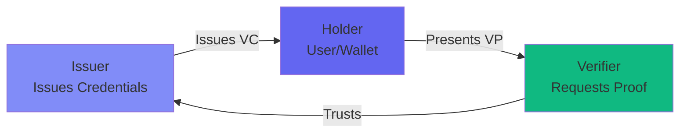
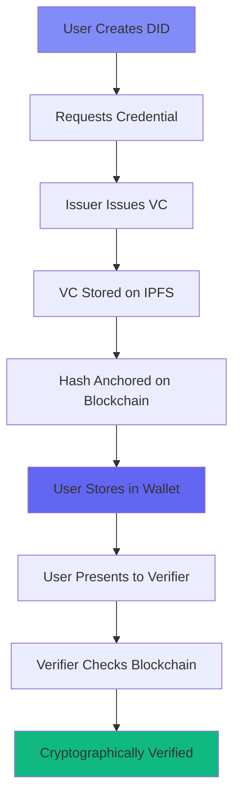

# Self-Sovereign Identity (SSI)

Self-Sovereign Identity (SSI) is a paradigm shift in digital identity management that gives individuals complete control over their personal data and digital credentials.

## What is SSI?

Traditional identity systems rely on centralized authorities (governments, corporations, platforms) to create, manage, and verify identities. In contrast, SSI empowers users to:

- **Own** their identity data
- **Control** who accesses their information
- **Store** credentials in their personal wallet
- **Share** only what's necessary through selective disclosure

<Info>
  Think of SSI like carrying a physical wallet with your ID cards, but digital, cryptographically secure, and under your complete control.
</Info>

## Core Principles

SSI is built on foundational principles that ensure user sovereignty:

<CardGroup cols={2}>
  <Card title="Self-Ownership" icon="user">
    You own your identity data. No one can take it away, modify it, or deny you access.
  </Card>
  
  <Card title="Control" icon="sliders">
    You decide who sees what information and for how long. Revoke access anytime.
  </Card>
  
  <Card title="Portability" icon="box-open">
    Take your identity anywhere. Not locked into a single platform or provider.
  </Card>
  
  <Card title="Persistence" icon="clock">
    Your identity persists as long as you want it to, independent of any third party.
  </Card>
  
  <Card title="Minimization" icon="eye-slash">
    Share only the minimum information necessary. Prove facts without revealing data.
  </Card>
  
  <Card title="Protection" icon="shield">
    Cryptographic security protects your data from tampering and unauthorized access.
  </Card>
</CardGroup>

## How SSI Works

SSI operates on a trust triangle between three key actors:

### The Three Actors

<AccordionGroup>
  <Accordion icon="building" title="Issuer">
    **Who:** Organizations that issue credentials (universities, governments, employers, etc.)
    
    **What they do:**
    - Create and sign verifiable credentials
    - Maintain schemas and templates
    - Manage credential lifecycle (issue, revoke)
    
    **Example:** A university issues a digital diploma to a graduate.
  </Accordion>
  
  <Accordion icon="wallet" title="Holder">
    **Who:** Individuals who own and manage their credentials
    
    **What they do:**
    - Store credentials in a digital wallet
    - Present credentials to verifiers
    - Control who accesses their data
    
    **Example:** A graduate stores their diploma in Sphyre ALV wallet.
  </Accordion>
  
  <Accordion icon="check-circle" title="Verifier">
    **Who:** Organizations that need to verify credentials (employers, service providers, etc.)
    
    **What they do:**
    - Request specific credentials or claims
    - Verify cryptographic proofs
    - Make decisions based on verified data
    
    **Example:** An employer verifies a candidate's degree before hiring.
  </Accordion>
</AccordionGroup>

## SSI vs Traditional Identity

| Aspect | Traditional Identity | Self-Sovereign Identity |
|--------|---------------------|-------------------------|
| **Control** | Centralized authority | Individual user |
| **Storage** | Company databases | User's wallet |
| **Privacy** | Full disclosure | Selective disclosure |
| **Verification** | Contact issuer | Cryptographic proof |
| **Portability** | Platform-locked | Universal |
| **Revocation** | Authority decides | User controls |
| **Security** | Honeypot risk | Distributed |

## Real-World Examples

<Steps>
  <Step title="Digital Driver's License">
    Government issues a verifiable digital driver's license. You store it in your wallet and show it during a traffic stop without revealing unnecessary information like your home address.
  </Step>
  
  <Step title="Educational Credentials">
    University issues your diploma as a verifiable credential. You can prove your degree to employers instantly without waiting for background checks.
  </Step>
  
  <Step title="Age Verification">
    Instead of showing your full ID, you use a zero-knowledge proof to prove you're over 21 at a bar without revealing your exact birthdate or address.
  </Step>
  
  <Step title="Professional Licenses">
    Medical board issues your license as a credential. Hospitals can verify your credentials instantly without calling the licensing board.
  </Step>
</Steps>

## Benefits of SSI

### For Individuals

<CardGroup cols={2}>
  <Card title="Privacy Control" icon="lock">
    Decide what to share and with whom. Use zero-knowledge proofs for minimal disclosure.
  </Card>
  
  <Card title="Reduced Identity Theft" icon="shield-check">
    No centralized database to hack. You control your data, not a company.
  </Card>
  
  <Card title="Convenience" icon="zap">
    One wallet for all credentials. No more forgotten passwords or lost documents.
  </Card>
  
  <Card title="Portability" icon="plane">
    Use your credentials anywhere, with anyone who supports SSI standards.
  </Card>
</CardGroup>

### For Organizations

<CardGroup cols={2}>
  <Card title="Reduced Costs" icon="dollar-sign">
    No need to store and secure user data. Lower compliance and liability costs.
  </Card>
  
  <Card title="Instant Verification" icon="bolt">
    Verify credentials cryptographically without contacting issuers.
  </Card>
  
  <Card title="Regulatory Compliance" icon="gavel">
    GDPR, CCPA compliant by design. Users control their data.
  </Card>
  
  <Card title="Fraud Prevention" icon="ban">
    Tamper-proof credentials anchored on blockchain. Impossible to forge.
  </Card>
</CardGroup>

## Key Technologies in SSI

SSI is enabled by several interconnected technologies:

<AccordionGroup>
  <Accordion icon="fingerprint" title="Decentralized Identifiers (DIDs)">
    Unique identifiers you create and control. Not issued by any authority.
    
    Learn more in [DID documentation](/concepts/did)
  </Accordion>
  
  <Accordion icon="certificate" title="Verifiable Credentials (VCs)">
    Digital credentials with cryptographic proofs that can be verified without contacting the issuer.
    
    Learn more in [VC documentation](/concepts/verifiable-credentials)
  </Accordion>
  
  <Accordion icon="shield-halved" title="Zero-Knowledge Proofs (ZKPs)">
    Prove facts about your credentials without revealing the underlying data.
    
    Learn more in [ZKP documentation](/concepts/zero-knowledge-proofs)
  </Accordion>
  
  <Accordion icon="link" title="Blockchain">
    Provides immutable anchoring of credential hashes for tamper-evidence.
  </Accordion>
  
  <Accordion icon="database" title="Decentralized Storage">
    IPFS and similar systems store credentials without central control.
  </Accordion>
</AccordionGroup>

## SSI in Sphyre

Sphyre implements SSI principles through:

1. **did:alyra** - Our DID method using post-quantum cryptography
2. **Fortro Engine** - Backend infrastructure for SSI operations
3. **Sphyre ALV** - User wallet for credential management
4. **IPFS Storage** - Decentralized credential storage
5. **Ethereum Anchoring** - Blockchain immutability

## Challenges & Solutions

<AccordionGroup>
  <Accordion icon="users" title="Adoption & Interoperability">
    **Challenge:** Different SSI implementations may not work together
    
    **Solution:** Sphyre follows W3C standards (DID Core, VC Data Model) for maximum interoperability
  </Accordion>
  
  <Accordion icon="mobile" title="User Experience">
    **Challenge:** Cryptography and key management can be complex
    
    **Solution:** Sphyre provides intuitive interfaces with seed phrase backup and biometric authentication
  </Accordion>
  
  <Accordion icon="key" title="Key Recovery">
    **Challenge:** Losing private keys means losing access to identity
    
    **Solution:** Encrypted seed phrase backup with multiple recovery options
  </Accordion>
  
  <Accordion icon="scale-balanced" title="Legal Recognition">
    **Challenge:** Digital credentials need legal validity
    
    **Solution:** Growing government adoption and eIDAS 2.0 in Europe recognizing SSI
  </Accordion>
</AccordionGroup>

## Standards & Specifications

Sphyre implements these W3C and industry standards:

- **W3C DID Core** - Decentralized Identifier specification
- **W3C Verifiable Credentials** - Credential data model
- **DIDComm** - Secure communication between DID controllers
- **JSON-LD** - Linked data format for credentials
- **NIST Post-Quantum Cryptography** - Future-proof security

## Future of SSI

SSI is rapidly evolving with exciting developments:

<CardGroup cols={3}>
  <Card title="Government Adoption" icon="landmark">
    EU's eIDAS 2.0 mandates SSI wallets for citizens
  </Card>
  
  <Card title="Mobile Integration" icon="mobile">
    Native SSI support in iOS and Android
  </Card>
  
  <Card title="Web3 Integration" icon="globe">
    SSI as foundation for decentralized web
  </Card>
  
  <Card title="AI & Privacy" icon="robot">
    SSI for privacy-preserving AI data sharing
  </Card>
  
  <Card title="IoT Identity" icon="microchip">
    SSI for device identities in IoT
  </Card>
  
  <Card title="Cross-border ID" icon="earth">
    Universal digital identity for travel
  </Card>
</CardGroup>

## Next Steps

<Steps>
  <Step title="Learn about DIDs">
    Understand how [Decentralized Identifiers](/concepts/did) work
  </Step>
  
  <Step title="Explore Verifiable Credentials">
    Deep dive into [Verifiable Credentials](/concepts/verifiable-credentials)
  </Step>
  
  <Step title="Try Sphyre">
    Follow the [quickstart guide](/quickstart) to create your first SSI wallet
  </Step>
  
  <Step title="Build with SSI">
    Check out our [developer guides](/developer/setup) to integrate SSI
  </Step>
</Steps>

## Additional Resources

<CardGroup cols={2}>
  <Card
    title="W3C DID Specification"
    icon="book"
    href="https://www.w3.org/TR/did-core/"
  >
    Official W3C standard for DIDs
  </Card>
  
  <Card
    title="Verifiable Credentials Spec"
    icon="certificate"
    href="https://www.w3.org/TR/vc-data-model/"
  >
    Official W3C standard for VCs
  </Card>
  
  <Card
    title="SSI Book"
    icon="book-open"
    href="https://www.manning.com/books/self-sovereign-identity"
  >
    Comprehensive guide to SSI
  </Card>
  
  <Card
    title="Decentralized Identity Foundation"
    icon="network-wired"
    href="https://identity.foundation/"
  >
    Industry consortium for SSI standards
  </Card>
</CardGroup>
