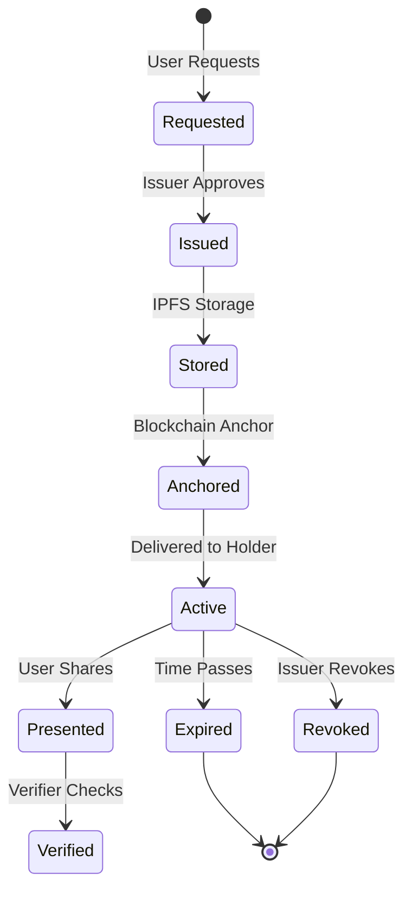
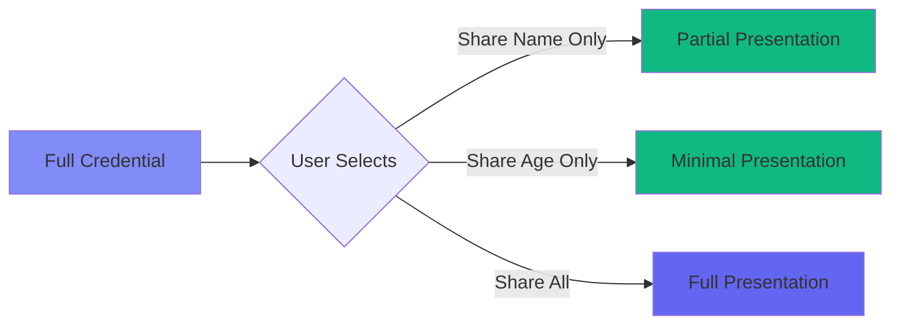

# Verifiable Credentials (VCs)

Verifiable Credentials are tamper-evident digital credentials that can be cryptographically verified without contacting the issuer. They're the digital equivalent of physical credentials like driver's licenses, diplomas, or identity cards.

## What is a Verifiable Credential?

A Verifiable Credential is a digital statement made by an issuer about a subject (usually the credential holder) that includes:

- **Claims:** Information about the subject (name, date of birth, degree, etc.)
- **Metadata:** Issuer, issue date, expiration, credential type
- **Proof:** Cryptographic signature that proves authenticity

<Info>
  Think of a VC like a digitally-signed diploma: it contains information about you, who issued it, and a cryptographic proof that it hasn't been tampered with.
</Info>

## VC Structure

A standard Verifiable Credential follows the W3C data model:

```json
{
  "@context": [
    "https://www.w3.org/2018/credentials/v1",
    "https://www.w3.org/2018/credentials/examples/v1"
  ],
  "id": "http://example.edu/credentials/3732",
  "type": ["VerifiableCredential", "UniversityDegreeCredential"],
  "issuer": "did:alyra:UniversityPublicKey...",
  "issuanceDate": "2024-01-01T00:00:00Z",
  "expirationDate": "2029-01-01T00:00:00Z",
  "credentialSubject": {
    "id": "did:alyra:StudentPublicKey...",
    "degree": {
      "type": "BachelorDegree",
      "name": "Bachelor of Science in Computer Science"
    },
    "gpa": "3.8"
  },
  "proof": {
    "type": "Dilithium",
    "created": "2024-01-01T00:00:00Z",
    "proofPurpose": "assertionMethod",
    "verificationMethod": "did:alyra:UniversityPublicKey...#keys-1",
    "signature": "eyJhbGciOiJEaWxpdGhpdW0yIiwiYjY0IjpmYWxzZSwiY3JpdCI..."
  }
}
```

## VC Components

<AccordionGroup>
  <Accordion icon="link" title="@context">
    Defines the meaning of terms used in the credential. Points to JSON-LD context files.
    
    ```json
    "@context": [
      "https://www.w3.org/2018/credentials/v1",
      "https://example.com/contexts/education/v1"
    ]
    ```
  </Accordion>
  
  <Accordion icon="fingerprint" title="id">
    Unique identifier for this specific credential instance.
    
    ```json
    "id": "https://university.edu/credentials/12345"
    ```
  </Accordion>
  
  <Accordion icon="tags" title="type">
    Specifies what kind of credential this is. Always includes `VerifiableCredential`.
    
    ```json
    "type": ["VerifiableCredential", "DriverLicense"]
    ```
  </Accordion>
  
  <Accordion icon="building" title="issuer">
    DID of the organization that issued the credential.
    
    ```json
    "issuer": "did:alyra:DMVPublicKey..."
    ```
  </Accordion>
  
  <Accordion icon="calendar" title="issuanceDate">
    When the credential was issued (ISO 8601 format).
    
    ```json
    "issuanceDate": "2024-01-15T10:30:00Z"
    ```
  </Accordion>
  
  <Accordion icon="user" title="credentialSubject">
    The actual claims about the subject. This is the main content of the credential.
    
    ```json
    "credentialSubject": {
      "id": "did:alyra:HolderDID...",
      "givenName": "Alice",
      "familyName": "Smith",
      "birthDate": "1990-01-01"
    }
    ```
  </Accordion>
  
  <Accordion icon="signature" title="proof">
    Cryptographic proof that makes the credential verifiable.
    
    ```json
    "proof": {
      "type": "Dilithium",
      "created": "2024-01-15T10:30:00Z",
      "verificationMethod": "did:alyra:IssuerDID...#keys-1",
      "signature": "base64_encoded_signature..."
    }
    ```
  </Accordion>
</AccordionGroup>

## VC Lifecycle



## Issuance Process

In Sphyre, credential issuance follows these steps:

<Steps>
  <Step title="User Requests Credential">
    User fills out a credential request form in Sphyre ALV
    
    ```typescript
    const request = {
      schemaId: "national-id-v1",
      templateId: "gov-national-id",
      claims: {
        fullName: "Alice Smith",
        dateOfBirth: "1990-01-01",
        nationality: "USA"
      },
      holderDid: "did:alyra:UserPublicKey..."
    };
    ```
  </Step>
  
  <Step title="Issuer Reviews Request">
    Request appears in issuer dashboard (Sphyre Issuers)
  </Step>
  
  <Step title="Issuer Approves & Signs">
    Issuer approves and Fortro Engine creates the VC
    
    ```rust
    let credential = VerifiableCredential {
        context: vec![VC_CONTEXT.to_string()],
        id: generate_credential_id(),
        types: vec!["VerifiableCredential".into(), schema.name.clone()],
        issuer: issuer_did.clone(),
        issuance_date: Utc::now(),
        credential_subject: claims,
        proof: sign_credential(&credential_data, &issuer_private_key)
    };
    ```
  </Step>
  
  <Step title="Store on IPFS">
    Credential is uploaded to IPFS for decentralized storage
    
    ```rust
    let ipfs_hash = ipfs_client.add_json(&credential).await?;
    ```
  </Step>
  
  <Step title="Anchor on Blockchain">
    IPFS hash is anchored on Ethereum for immutability
    
    ```rust
    let tx = contract.anchor_credential(
        ipfs_hash,
        credential.id,
        issuer_did
    ).send().await?;
    ```
  </Step>
  
  <Step title="Deliver to Holder">
    Credential is sent to user's wallet
  </Step>
</Steps>

## Verification Process

Verifiers can check credential authenticity without contacting the issuer:

<Steps>
  <Step title="Receive Presentation">
    Verifier receives a Verifiable Presentation containing the VC
  </Step>
  
  <Step title="Extract Credential">
    Parse the VC and extract the proof
  </Step>
  
  <Step title="Resolve Issuer DID">
    Get issuer's public key from their DID
    
    ```typescript
    const didDocument = await resolveDID(credential.issuer);
    const publicKey = didDocument.verificationMethod[0].publicKeyBase64;
    ```
  </Step>
  
  <Step title="Verify Signature">
    Check cryptographic signature using issuer's public key
    
    ```typescript
    const isValid = verifySignature(
      credential,
      credential.proof.signature,
      publicKey
    );
    ```
  </Step>
  
  <Step title="Check Blockchain Anchor">
    Verify the credential hash exists on blockchain
    
    ```typescript
    const onChain = await contract.verifyAnchor(ipfsHash);
    ```
  </Step>
  
  <Step title="Check Revocation Status">
    Ensure credential hasn't been revoked
    
    ```typescript
    const isRevoked = await contract.isRevoked(credential.id);
    ```
  </Step>
  
  <Step title="Validate Expiration">
    Check if credential is still valid
    
    ```typescript
    const isExpired = new Date() > new Date(credential.expirationDate);
    ```
  </Step>
</Steps>

## Credential Types in Sphyre

Sphyre supports various credential schemas:

<CardGroup cols={2}>
  <Card title="National ID" icon="id-card">
    Government-issued identity credentials with full name, DOB, nationality
  </Card>
  
  <Card title="Driver's License" icon="car">
    Driving credentials with license class, restrictions, expiration
  </Card>
  
  <Card title="Student ID" icon="graduation-cap">
    Educational institution credentials with student number, program
  </Card>
  
  <Card title="Employee Badge" icon="briefcase">
    Employment credentials with job title, department, access level
  </Card>
  
  <Card title="Professional License" icon="certificate">
    Professional certifications with license number, specialty, board
  </Card>
  
  <Card title="Health Insurance" icon="heart-pulse">
    Insurance credentials with policy number, coverage type, provider
  </Card>
</CardGroup>

## Selective Disclosure

VCs support selective disclosure - sharing only specific claims:



### Example: Age Verification

Instead of showing full ID:

```json
// Full credential contains:
{
  "name": "Alice Smith",
  "dateOfBirth": "1990-01-01",
  "address": "123 Main St",
  "idNumber": "ABC123456"
}

// Selective disclosure - only share age proof:
{
  "isOver21": true  // Proven via ZKP without revealing exact birthdate
}
```

## Verifiable Presentations

To share credentials, holders create Verifiable Presentations (VPs):

```json
{
  "@context": ["https://www.w3.org/2018/credentials/v1"],
  "type": "VerifiablePresentation",
  "verifiableCredential": [{
    // Full VC or selected claims
  }],
  "holder": "did:alyra:HolderPublicKey...",
  "proof": {
    "type": "Dilithium",
    "created": "2024-01-15T12:00:00Z",
    "challenge": "random-challenge-from-verifier",
    "domain": "verifier.sphyre.tech",
    "proofPurpose": "authentication",
    "verificationMethod": "did:alyra:HolderPublicKey...#keys-1",
    "signature": "holder_signature..."
  }
}
```

**Key Points:**
- Holder signs the presentation (not just the credential)
- Includes challenge from verifier to prevent replay attacks
- Can contain multiple credentials
- Proves holder controls the DID

## Revocation

Issuers can revoke credentials if needed:

### Revocation Methods

<Tabs>
  <Tab title="Status List">
    Credential contains a reference to a revocation list
    
    ```json
    "credentialStatus": {
      "id": "https://issuer.com/status/1#94567",
      "type": "RevocationList2020Status",
      "revocationListIndex": "94567",
      "revocationListCredential": "https://issuer.com/status/1"
    }
    ```
  </Tab>
  
  <Tab title="Blockchain Registry">
    Sphyre's approach: Mark as revoked on Ethereum smart contract
    
    ```solidity
    function revokeCredential(bytes32 credentialId) external {
        require(msg.sender == credentialIssuers[credentialId]);
        revokedCredentials[credentialId] = true;
        emit CredentialRevoked(credentialId);
    }
    ```
  </Tab>
</Tabs>

## Storage & Privacy

### IPFS Storage

<CardGroup cols={2}>
  <Card title="Content-Addressed" icon="hashtag">
    Files identified by cryptographic hash, ensuring data integrity
  </Card>
  
  <Card title="Decentralized" icon="network-wired">
    No single point of failure, distributed across IPFS network
  </Card>
  
  <Card title="Immutable" icon="lock">
    Content cannot be modified; changes create new hash
  </Card>
  
  <Card title="Optional Encryption" icon="shield">
    Credentials can be encrypted before upload for privacy
  </Card>
</CardGroup>

### Privacy Considerations

<Warning>
  VCs stored on IPFS are public by default. For sensitive data, use encryption or store only hashes.
</Warning>

**Privacy Strategies:**

1. **Encryption:** Encrypt credential before IPFS upload
2. **Hashed Claims:** Store only hashes of sensitive data
3. **Zero-Knowledge Proofs:** Prove claims without revealing data
4. **Pairwise Credentials:** Issue different credentials for different relationships

## Schema Management

Schemas define the structure of credentials:

```json
{
  "id": "national-id-v1",
  "name": "National ID",
  "version": "1.0",
  "description": "Government-issued national identification",
  "fields": [
    {
      "name": "fullName",
      "type": "string",
      "required": true,
      "description": "Legal full name"
    },
    {
      "name": "dateOfBirth",
      "type": "date",
      "required": true,
      "description": "Date of birth (YYYY-MM-DD)"
    },
    {
      "name": "nationality",
      "type": "string",
      "required": true,
      "description": "Country of citizenship"
    },
    {
      "name": "idNumber",
      "type": "string",
      "required": true,
      "description": "Unique identification number"
    }
  ],
  "issuer": "did:alyra:GovernmentDID..."
}
```

## Best Practices

<AccordionGroup>
  <Accordion icon="calendar-check" title="Expiration Dates">
    Always set appropriate expiration dates. Credentials shouldn't be valid forever.
    
    ```json
    "expirationDate": "2029-12-31T23:59:59Z"
    ```
  </Accordion>
  
  <Accordion icon="shield-check" title="Credential Scope">
    Issue specific credentials for specific purposes. Don't create "super credentials" with all user data.
  </Accordion>
  
  <Accordion icon="eye-slash" title="Minimize Data">
    Include only necessary claims. Less data = better privacy.
  </Accordion>
  
  <Accordion icon="rotate" title="Versioning">
    Version your schemas and credentials for backward compatibility.
    
    ```json
    "version": "1.0",
    "schemaVersion": "2.1"
    ```
  </Accordion>
  
  <Accordion icon="link" title="Linked Data">
    Use JSON-LD contexts for semantic interoperability across systems.
  </Accordion>
</AccordionGroup>

## VC vs Traditional Credentials

| Feature | Traditional | Verifiable Credential |
|---------|------------|----------------------|
| **Format** | Paper/PDF | JSON-LD |
| **Verification** | Contact issuer | Cryptographic proof |
| **Tampering** | Easy to forge | Cryptographically impossible |
| **Sharing** | Photocopy | Selective disclosure |
| **Revocation** | Difficult | Instant via blockchain |
| **Privacy** | Full disclosure | Minimal disclosure |
| **Portability** | Physical/email | Digital wallet |
| **Speed** | Days/weeks | Instant |

## Advanced Features

### Composite Credentials

Combine multiple credentials for complex proofs:

```json
{
  "type": "VerifiablePresentation",
  "verifiableCredential": [
    { /* University degree */ },
    { /* Professional license */ },
    { /* Employment verification */ }
  ]
}
```

### Derived Credentials

Create new credentials based on existing ones:

```typescript
// Original: Full birthdate credential
// Derived: "Over 21" credential
const derivedCredential = deriveCredential(
  originalCredential,
  ["isOver21"],  // Only this claim
  zkProof        // Zero-knowledge proof
);
```

### Delegated Credentials

Issue credentials on behalf of another issuer:

```json
{
  "issuer": "did:alyra:RegionalOffice...",
  "delegatedFrom": "did:alyra:NationalAuthority...",
  "proof": {
    "type": "DelegatedProof",
    "delegationCredential": { /* Proof of delegation */ }
  }
}
```

## Code Examples

### Creating a Credential (Backend)

```rust
use serde_json::json;
use chrono::Utc;

async fn issue_credential(
    issuer_did: &str,
    holder_did: &str,
    claims: HashMap<String, String>,
    schema_id: &str
) -> Result<VerifiableCredential> {
    // Create credential structure
    let credential = json!({
        "@context": ["https://www.w3.org/2018/credentials/v1"],
        "type": ["VerifiableCredential", schema_id],
        "issuer": issuer_did,
        "issuanceDate": Utc::now().to_rfc3339(),
        "credentialSubject": {
            "id": holder_did,
            "claims": claims
        }
    });
    
    // Sign credential
    let signature = sign_with_dilithium(&credential, issuer_private_key)?;
    
    // Add proof
    credential["proof"] = json!({
        "type": "Dilithium",
        "created": Utc::now().to_rfc3339(),
        "verificationMethod": format!("{}#keys-1", issuer_did),
        "signature": base64::encode(signature)
    });
    
    Ok(credential)
}
```

### Verifying a Credential (Frontend)

```typescript
async function verifyCredential(credential: VerifiableCredential) {
  // 1. Resolve issuer DID
  const issuerDID = credential.issuer;
  const didDocument = await resolveDID(issuerDID);
  
  // 2. Get public key
  const publicKey = didDocument.verificationMethod[0].publicKeyBase64;
  
  // 3. Verify signature
  const credentialWithoutProof = { ...credential };
  delete credentialWithoutProof.proof;
  
  const isValidSignature = await verifyDilithiumSignature(
    JSON.stringify(credentialWithoutProof),
    credential.proof.signature,
    publicKey
  );
  
  // 4. Check expiration
  const isExpired = new Date() > new Date(credential.expirationDate);
  
  // 5. Check revocation
  const isRevoked = await checkRevocationStatus(credential.id);
  
  return isValidSignature && !isExpired && !isRevoked;
}
```

## Resources

<CardGroup cols={2}>
  <Card
    title="W3C VC Data Model"
    icon="book"
    href="https://www.w3.org/TR/vc-data-model/"
  >
    Official specification for Verifiable Credentials
  </Card>
  
  <Card
    title="JSON-LD Playground"
    icon="code"
    href="https://json-ld.org/playground/"
  >
    Test and validate JSON-LD credentials
  </Card>
  
  <Card
    title="VC Implementation Guidelines"
    icon="file-contract"
    href="https://www.w3.org/TR/vc-imp-guide/"
  >
    Best practices for implementing VCs
  </Card>
  
  <Card
    title="Credential Schemas"
    icon="shapes"
    href="https://schema.org/"
  >
    Standard vocabularies for credentials
  </Card>
</CardGroup>

## Next Steps

<Steps>
  <Step title="Issue Your First Credential">
    Follow the [issuing credentials guide](/guides/issuing-credentials)
  </Step>
  
  <Step title="Learn About ZKP">
    Explore [Zero-Knowledge Proofs](/concepts/zero-knowledge-proofs) for privacy
  </Step>
  
  <Step title="API Integration">
    Check the [Issuer API reference](/api-reference/issuer/issue-credential)
  </Step>
  
  <Step title="Build an Issuer">
    Read the [developer integration guide](/developer/integration)
  </Step>
</Steps>
