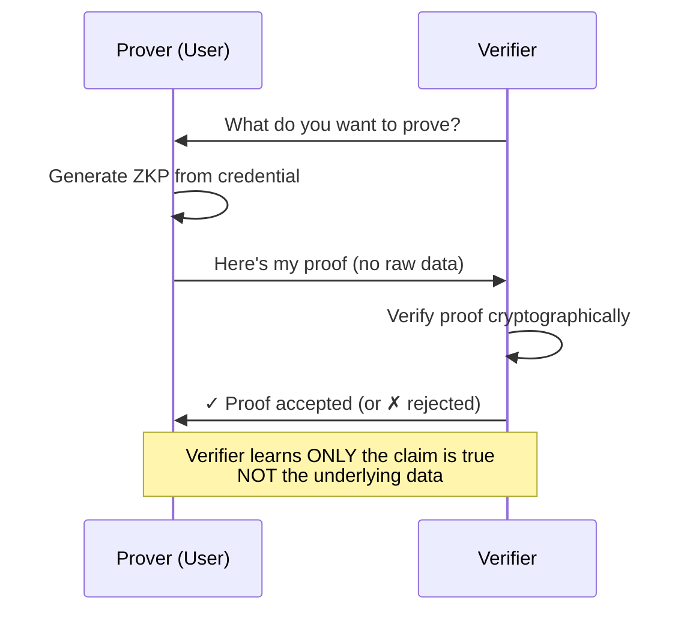

# Zero-Knowledge Proofs (ZKP)

Zero-Knowledge Proofs enable you to prove a statement is true without revealing any information beyond the validity of the statement itself. In the context of SSI, ZKPs allow you to prove claims about your credentials without disclosing the actual data.

## What is a Zero-Knowledge Proof?

A Zero-Knowledge Proof is a cryptographic method where one party (the prover) can prove to another party (the verifier) that a statement is true, without revealing any information beyond the truth of that statement.

<Info>
  **Example:** Prove you're over 21 years old without revealing your exact birthdate, or prove you're a citizen without showing your passport number.
</Info>

## How ZKP Works



## ZKP Properties

A valid zero-knowledge proof must have three properties:

<CardGroup cols={3}>
  <Card title="Completeness" icon="check-circle">
    If the statement is true, an honest prover can convince an honest verifier
  </Card>
  
  <Card title="Soundness" icon="shield">
    If the statement is false, no dishonest prover can convince the verifier (except with negligible probability)
  </Card>
  
  <Card title="Zero-Knowledge" icon="eye-slash">
    The verifier learns nothing except that the statement is true
  </Card>
</CardGroup>

## Real-World Examples

### Age Verification

**Traditional Approach:**
```json
{
  "name": "Alice Smith",
  "dateOfBirth": "1995-03-15",
  "address": "123 Main St",
  "idNumber": "ABC123456"
}
```
❌ Reveals unnecessary personal information

**Zero-Knowledge Approach:**
```json
{
  "statement": "holder is over 21 years old",
  "proof": "zkp_proof_data...",
  "result": true
}
```
✅ Proves age without revealing birthdate

### Income Verification

**Scenario:** Loan application requires proof of income over $50,000

**Traditional:**
```json
{
  "annualIncome": "$75,000",
  "employer": "Tech Corp",
  "position": "Senior Engineer"
}
```

**Zero-Knowledge:**
```json
{
  "statement": "annual income > $50,000",
  "proof": "zkp_proof...",
  "verified": true
}
```

### Citizenship Proof

**Scenario:** Access to service requires EU citizenship

**Traditional:** Show passport (reveals name, birthdate, passport number, photo)

**Zero-Knowledge:** Prove "I am an EU citizen" without showing passport details

## Types of ZKP

<AccordionGroup>
  <Accordion icon="calculator" title="Range Proofs">
    Prove a value falls within a range without revealing the exact value.
    
    **Example:** Prove age is between 18-65 without showing exact age
    
    ```typescript
    const rangeProof = generateRangeProof({
      value: userAge,
      min: 18,
      max: 65,
      credential: ageCredential
    });
    ```
  </Accordion>
  
  <Accordion icon="list-check" title="Membership Proofs">
    Prove you belong to a set without revealing which member you are.
    
    **Example:** Prove you're an employee of approved companies without saying which one
    
    ```typescript
    const membershipProof = generateMembershipProof({
      userCompany: "TechCorp",
      allowedSet: ["TechCorp", "FinanceCo", "HealthInc"],
      credential: employmentCredential
    });
    ```
  </Accordion>
  
  <Accordion icon="equals" title="Equality Proofs">
    Prove two values are equal without revealing the values.
    
    **Example:** Prove your name in two different credentials is the same
    
    ```typescript
    const equalityProof = generateEqualityProof({
      credential1: passportCredential,
      credential2: driverLicenseCredential,
      field: "name"
    });
    ```
  </Accordion>
  
  <Accordion icon="calculator" title="Computation Proofs">
    Prove the result of a computation without revealing inputs.
    
    **Example:** Prove average salary of a group without revealing individual salaries
    
    ```typescript
    const computationProof = generateComputationProof({
      inputs: employeeSalaries,
      computation: "average",
      result: averageSalary
    });
    ```
  </Accordion>
</AccordionGroup>

## ZKP in Sphyre

Sphyre implements ZKP for selective disclosure and privacy-preserving verification:

### Implementation

```typescript
// Generate ZKP for age verification
async function generateAgeProof(
  birthDateCredential: VerifiableCredential,
  minimumAge: number
): Promise<ZeroKnowledgeProof> {
  // Extract birthdate from credential
  const birthDate = new Date(birthDateCredential.credentialSubject.dateOfBirth);
  
  // Calculate age
  const age = calculateAge(birthDate);
  
  // Generate proof that age >= minimumAge
  const proof = await zkp.prove({
    statement: `age >= ${minimumAge}`,
    privateInput: age,
    publicInput: minimumAge,
    credential: birthDateCredential
  });
  
  return proof;
}

// Verify the proof
async function verifyAgeProof(
  proof: ZeroKnowledgeProof,
  minimumAge: number
): Promise<boolean> {
  return await zkp.verify({
    proof: proof,
    statement: `age >= ${minimumAge}`,
    publicInput: minimumAge
  });
}
```

### Use Cases in Sphyre

<CardGroup cols={2}>
  <Card title="Age Verification" icon="cake-candles">
    Prove you meet age requirements without revealing exact birthdate
  </Card>
  
  <Card title="Income Verification" icon="dollar-sign">
    Prove income threshold without disclosing exact salary
  </Card>
  
  <Card title="Location Proof" icon="location-dot">
    Prove residency in a region without revealing exact address
  </Card>
  
  <Card title="Qualification Proof" icon="graduation-cap">
    Prove you meet educational requirements without showing full transcript
  </Card>
  
  <Card title="Credit Score Range" icon="chart-line">
    Prove credit score is above threshold without exact number
  </Card>
  
  <Card title="Access Control" icon="key">
    Prove membership in authorized group without identifying yourself
  </Card>
</CardGroup>

## ZKP Workflow in Sphyre

<Steps>
  <Step title="Verifier Creates Request">
    Verifier specifies what they want to prove
    
    ```json
    {
      "type": "ZeroKnowledgeProofRequest",
      "statement": "age >= 21",
      "requiredCredentialType": "NationalID"
    }
    ```
  </Step>
  
  <Step title="User Receives Request">
    Request appears in Sphyre ALV wallet
  </Step>
  
  <Step title="User Selects Credential">
    Choose which credential to use for the proof
  </Step>
  
  <Step title="Generate ZKP">
    Wallet generates proof using credential data
    
    ```typescript
    const zkProof = await generateZKP({
      credential: selectedCredential,
      statement: request.statement
    });
    ```
  </Step>
  
  <Step title="Submit Proof">
    Send proof to verifier (no raw data included)
  </Step>
  
  <Step title="Verifier Validates">
    Verifier cryptographically validates the proof
    
    ```typescript
    const isValid = await verifyZKP(zkProof, statement);
    ```
  </Step>
</Steps>

## Advanced ZKP Techniques

### zk-SNARKs

**Zero-Knowledge Succinct Non-Interactive Arguments of Knowledge**

<CardGroup cols={2}>
  <Card title="Succinct" icon="compress">
    Proofs are very small (hundreds of bytes)
  </Card>
  
  <Card title="Non-Interactive" icon="handshake-simple">
    No back-and-forth needed between prover and verifier
  </Card>
  
  <Card title="Fast Verification" icon="bolt">
    Verification is extremely quick
  </Card>
  
  <Card title="Privacy-Preserving" icon="shield-halved">
    Complete privacy for the prover
  </Card>
</CardGroup>

**Use Cases:**
- Complex credential combinations
- Multiple claim verification
- Blockchain scalability

### zk-STARKs

**Zero-Knowledge Scalable Transparent Arguments of Knowledge**

**Advantages:**
- No trusted setup required
- Quantum-resistant
- Transparent and auditable

**Trade-offs:**
- Larger proof sizes than SNARKs
- Slower proof generation

## Credential Predicates

Predicates define conditions that can be proven with ZKP:

```json
{
  "predicates": [
    {
      "type": "greaterThan",
      "attribute": "age",
      "value": 21
    },
    {
      "type": "lessThan",
      "attribute": "income",
      "value": 100000
    },
    {
      "type": "memberOf",
      "attribute": "country",
      "values": ["USA", "Canada", "Mexico"]
    },
    {
      "type": "equal",
      "attribute": "verified",
      "value": true
    }
  ]
}
```

## Privacy Levels

Different scenarios require different privacy levels:

<Tabs>
  <Tab title="Full Disclosure">
    **When:** High trust relationship, legal requirement
    
    ```json
    {
      "name": "Alice Smith",
      "dateOfBirth": "1990-01-01",
      "address": "123 Main St"
    }
    ```
    
    Privacy: ⭐ (Low)
  </Tab>
  
  <Tab title="Selective Disclosure">
    **When:** Partial trust, specific needs
    
    ```json
    {
      "name": "Alice Smith",
      "age": 34
    }
    ```
    
    Privacy: ⭐⭐⭐ (Medium)
  </Tab>
  
  <Tab title="Zero-Knowledge Proof">
    **When:** Minimal trust, maximum privacy
    
    ```json
    {
      "statement": "age > 21",
      "proof": "zkp_data...",
      "verified": true
    }
    ```
    
    Privacy: ⭐⭐⭐⭐⭐ (Maximum)
  </Tab>
</Tabs>

## Implementation Example

### Complete Age Verification Flow

```typescript
// 1. Verifier creates ZKP request
const zkRequest = {
  id: "req_123",
  type: "ZKPresentationRequest",
  verifierId: "did:alyra:VerifierDID...",
  predicate: {
    type: "greaterThanOrEqual",
    attribute: "age",
    value: 21
  },
  requiredCredentialType: "NationalID",
  challenge: generateChallenge()
};

// 2. User's wallet processes request
class ZKPService {
  async createAgeProof(
    credential: VerifiableCredential,
    minimumAge: number,
    challenge: string
  ): Promise<ZKProof> {
    // Extract private data
    const birthDate = credential.credentialSubject.dateOfBirth;
    const age = this.calculateAge(birthDate);
    
    // Generate commitment
    const commitment = this.generateCommitment(age);
    
    // Create proof
    const proof = await this.proveInequality({
      privateValue: age,
      publicThreshold: minimumAge,
      commitment: commitment,
      challenge: challenge
    });
    
    return {
      statement: `age >= ${minimumAge}`,
      commitment: commitment,
      proof: proof,
      credentialId: credential.id,
      issuerDid: credential.issuer
    };
  }
  
  private calculateAge(birthDate: string): number {
    const birth = new Date(birthDate);
    const today = new Date();
    let age = today.getFullYear() - birth.getFullYear();
    const monthDiff = today.getMonth() - birth.getMonth();
    
    if (monthDiff < 0 || (monthDiff === 0 && today.getDate() < birth.getDate())) {
      age--;
    }
    
    return age;
  }
}

// 3. Verifier validates proof
async function validateZKProof(
  zkProof: ZKProof,
  minimumAge: number,
  challenge: string
): Promise<VerificationResult> {
  // Verify commitment
  const commitmentValid = await verifyCommitment(
    zkProof.commitment,
    zkProof.proof
  );
  
  // Verify inequality proof
  const proofValid = await verifyInequalityProof({
    commitment: zkProof.commitment,
    threshold: minimumAge,
    proof: zkProof.proof,
    challenge: challenge
  });
  
  // Verify credential validity
  const credentialValid = await verifyCredentialSignature(
    zkProof.credentialId,
    zkProof.issuerDid
  );
  
  return {
    valid: commitmentValid && proofValid && credentialValid,
    statement: zkProof.statement,
    timestamp: new Date()
  };
}
```

## Security Considerations

<AccordionGroup>
  <Accordion icon="rotate" title="Replay Attacks">
    **Risk:** Reusing the same proof multiple times
    
    **Mitigation:** Include unique challenges and timestamps
    
    ```typescript
    const proof = {
      challenge: verifierChallenge,
      timestamp: Date.now(),
      nonce: generateNonce()
    };
    ```
  </Accordion>
  
  <Accordion icon="link" title="Linkability">
    **Risk:** Correlating proofs to track users
    
    **Mitigation:** Use different credentials or randomized proofs
    
    ```typescript
    const proof = addRandomness(baseProof);
    ```
  </Accordion>
  
  <Accordion icon="key" title="Side-Channel Attacks">
    **Risk:** Leaking information through timing or resources
    
    **Mitigation:** Constant-time operations, noise injection
  </Accordion>
  
  <Accordion icon="database" title="Credential Revocation">
    **Risk:** Proving claims from revoked credentials
    
    **Mitigation:** Include non-revocation proofs
    
    ```typescript
    const proof = {
      claimProof: zkClaimProof,
      nonRevocationProof: zkNonRevocationProof
    };
    ```
  </Accordion>
</AccordionGroup>

## Performance Considerations

| ZKP Type | Proof Size | Proof Time | Verify Time | Setup |
|----------|-----------|------------|-------------|-------|
| **zk-SNARK** | ~200 bytes | ~1 second | ~1 ms | Trusted setup |
| **zk-STARK** | ~50 KB | ~5 seconds | ~10 ms | Transparent |
| **Bulletproofs** | ~1 KB | ~2 seconds | ~5 ms | None |
| **Range Proofs** | ~2 KB | ~500 ms | ~2 ms | None |

## Comparison: Traditional vs ZKP

| Aspect | Traditional Verification | Zero-Knowledge Proof |
|--------|-------------------------|---------------------|
| **Data Shared** | Full credential | No raw data |
| **Privacy** | Low | Maximum |
| **Trust Required** | High | Minimal |
| **Verification** | Check all data | Verify proof only |
| **Complexity** | Low | Medium to High |
| **Speed** | Instant | ~1-5 seconds |
| **Standards** | Well established | Emerging |

## ZKP Libraries & Tools

Sphyre uses and recommends these ZKP libraries:

<CardGroup cols={2}>
  <Card title="circom" icon="gear">
    Circuit compiler for zk-SNARKs
    
    [circom documentation](https://docs.circom.io/)
  </Card>
  
  <Card title="snarkjs" icon="js">
    JavaScript library for zk-SNARKs
    
    [snarkjs on GitHub](https://github.com/iden3/snarkjs)
  </Card>
  
  <Card title="ZoKrates" icon="toolbox">
    High-level language for ZKP
    
    [ZoKrates documentation](https://zokrates.github.io/)
  </Card>
  
  <Card title="libsnark" icon="c">
    C++ library for zk-SNARKs
    
    [libsnark on GitHub](https://github.com/scipr-lab/libsnark)
  </Card>
</CardGroup>

## Future of ZKP in Sphyre

<Steps>
  <Step title="Enhanced Privacy">
    More granular ZKP options for complex predicates
  </Step>
  
  <Step title="Performance Optimization">
    Faster proof generation using optimized circuits
  </Step>
  
  <Step title="Recursive Proofs">
    Combine multiple proofs into a single compact proof
  </Step>
  
  <Step title="Universal Composability">
    Standard ZKP format across all SSI systems
  </Step>
</Steps>

## Common Use Cases

<CardGroup cols={3}>
  <Card title="KYC Compliance" icon="user-shield">
    Prove identity verification without revealing PII
  </Card>
  
  <Card title="Financial Services" icon="building-columns">
    Prove creditworthiness without exposing financial details
  </Card>
  
  <Card title="Healthcare" icon="heart-pulse">
    Prove insurance coverage without sharing medical history
  </Card>
  
  <Card title="Education" icon="book">
    Prove qualifications without full transcript
  </Card>
  
  <Card title="Employment" icon="briefcase">
    Prove work authorization without visa details
  </Card>
  
  <Card title="Voting" icon="check-to-slot">
    Prove eligibility without revealing identity
  </Card>
</CardGroup>

## Resources

<CardGroup cols={2}>
  <Card
    title="ZKProof Standards"
    icon="book"
    href="https://zkproof.org/"
  >
    Community-driven ZKP standardization
  </Card>
  
  <Card
    title="Zero Knowledge Podcast"
    icon="podcast"
    href="https://zeroknowledge.fm/"
  >
    Learn about ZKP developments
  </Card>
  
  <Card
    title="Awesome ZKP"
    icon="star"
    href="https://github.com/matter-labs/awesome-zero-knowledge-proofs"
  >
    Curated list of ZKP resources
  </Card>
  
  <Card
    title="ZKP Course"
    icon="graduation-cap"
    href="https://zk-learning.org/"
  >
    Learn ZKP fundamentals
  </Card>
</CardGroup>

## Next Steps

<Steps>
  <Step title="Try ZKP in Sphyre">
    Use ZKP for age verification in the [quickstart guide](/quickstart)
  </Step>
  
  <Step title="Explore Wallet Features">
    Learn about [Sphyre ALV](/components/sphyre-alv) ZKP capabilities
  </Step>
  
  <Step title="Developer Integration">
    Implement ZKP in your app with our [API guide](/api-reference/verifier/verify-presentation)
  </Step>
  
  <Step title="Advanced Tutorials">
    Check out [developer guides](/developer/integration) for custom ZKP circuits
  </Step>
</Steps>
