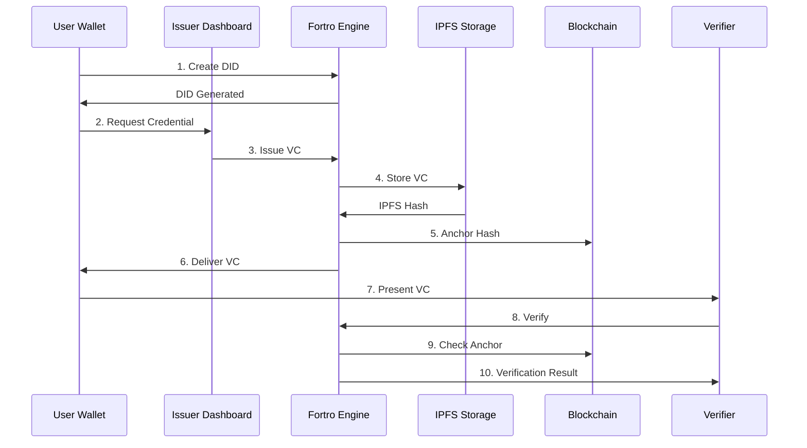

# Get Started with Sphyre

This guide will walk you through setting up your first Sphyre wallet, receiving a credential, and presenting it to a verifier. The entire process takes less than 5 minutes!

## Overview

In this quickstart, you'll:

1. Create a wallet and generate your DID
2. Request and receive a verifiable credential
3. Present your credential to a verifier
4. Understand the basic SSI flow

<Note>
  All Sphyre applications are already deployed and accessible online. No installation required to get started!
</Note>

## Step 1: Create Your Wallet

The wallet is your personal identity hub where you store and manage your credentials.

<Steps>
  <Step title="Open Sphyre ALV">
    Navigate to [app.sphyre.tech](https://app.sphyre.tech)
  </Step>
  
  <Step title="Create New Wallet">
    Click **"Create New Wallet"** on the onboarding screen
  </Step>
  
  <Step title="Save Your Seed Phrase">
    You'll receive a 12-word seed phrase. **Write it down and store it securely!**
    
    <Warning>
      Your seed phrase is the only way to recover your wallet. Never share it with anyone!
    </Warning>
  </Step>
  
  <Step title="Verify Your Seed Phrase">
    Confirm 3 random words from your seed phrase to ensure you've saved it correctly
  </Step>
  
  <Step title="View Your DID">
    Your Decentralized Identifier (DID) will be displayed. This is your unique identity on the Sphyre network.
    
    Format: `did:alyra:<base64-public-key>`
  </Step>
</Steps>

<Check>
  **Success!** You now have a self-sovereign digital identity.
</Check>

## Step 2: Request a Credential

Now let's get your first verifiable credential.

<Steps>
  <Step title="Navigate to Request Credential">
    From the wallet dashboard, click on **"Request Credential"**
  </Step>
  
  <Step title="Select a Schema">
    Choose a credential type (e.g., National ID, Driver's License, Student ID)
    
    ```
    Available schemas:
    - National ID
    - Driver's License  
    - Student ID
    - Employee Badge
    - Professional License
    - Health Insurance Card
    ```
  </Step>
  
  <Step title="Choose an Issuer">
    Select a template from an authorized issuer organization
  </Step>
  
  <Step title="Fill in Your Information">
    Complete the credential request form with your details
  </Step>
  
  <Step title="Submit Request">
    Your request is sent directly to the issuer's dashboard
  </Step>
</Steps>

## Step 3: Issuer Approves (Demo)

For this demo, you can also act as the issuer:

<Steps>
  <Step title="Open Issuer Dashboard">
    Navigate to [issuers.sphyre.tech](https://issuers.sphyre.tech)
  </Step>
  
  <Step title="Log In">
    Use demo credentials or register as an issuer
  </Step>
  
  <Step title="View Pending Requests">
    Go to **"Credential Requests"** to see incoming requests
  </Step>
  
  <Step title="Approve Request">
    Click **"Approve"** on your credential request
    
    The system will:
    - Generate a verifiable credential
    - Sign it cryptographically
    - Store it on IPFS
    - Anchor the hash on blockchain
    - Deliver it to the user's wallet
  </Step>
</Steps>

## Step 4: View Your Credential

Return to your wallet to see the newly issued credential:

<Steps>
  <Step title="Open Your Wallet">
    Go back to [app.sphyre.tech](https://app.sphyre.tech)
  </Step>
  
  <Step title="View Credentials">
    Navigate to **"My Credentials"** or the credential slider on the dashboard
  </Step>
  
  <Step title="Inspect Details">
    Click on a credential to see:
    - Credential type and issuer
    - All claims and values
    - Issue date and expiration
    - Cryptographic proof
  </Step>
  
  <Step title="Generate QR Code">
    Click **"Show QR"** to generate a shareable QR code for presentation
  </Step>
</Steps>

## Step 5: Present Your Credential

Now let's verify your credential with a verifier:

<Steps>
  <Step title="Scan Presentation Request">
    The verifier will provide a QR code for their presentation request
    
    Or manually navigate to the verification flow
  </Step>
  
  <Step title="Review Request">
    See what information the verifier is requesting
    
    <Info>
      Thanks to selective disclosure, you only share what's requested!
    </Info>
  </Step>
  
  <Step title="Consent to Share">
    Choose whether to approve or deny the request
    
    You can also use Zero-Knowledge Proofs to prove facts without revealing data (e.g., "I am over 18" without showing your birthdate)
  </Step>
  
  <Step title="Submit Presentation">
    Your credential is verified instantly by the verifier
  </Step>
</Steps>

<Check>
  **Complete!** You've successfully completed the full SSI flow.
</Check>

## Understanding What Happened

Here's the technical flow you just experienced:



## Key Concepts You've Learned

<AccordionGroup>
  <Accordion icon="fingerprint" title="Decentralized Identifier (DID)">
    Your unique identity that you control. No central authority can revoke or modify it.
  </Accordion>
  
  <Accordion icon="certificate" title="Verifiable Credential (VC)">
    A tamper-proof digital credential that can be cryptographically verified without contacting the issuer.
  </Accordion>
  
  <Accordion icon="shield-check" title="Selective Disclosure">
    Share only what's needed. You control exactly which claims from your credentials to present.
  </Accordion>
  
  <Accordion icon="eye-slash" title="Zero-Knowledge Proofs">
    Prove facts about your credentials without revealing the underlying data.
  </Accordion>
</AccordionGroup>

## Next Steps

<CardGroup cols={2}>
  <Card
    title="Learn Core Concepts"
    icon="book"
    href="/concepts/ssi"
  >
    Deep dive into SSI, DIDs, and VCs
  </Card>
  
  <Card
    title="Explore Components"
    icon="diagram-project"
    href="/components/fortro-engine"
  >
    Understand each part of the ecosystem
  </Card>
  
  <Card
    title="Developer Integration"
    icon="code"
    href="/developer/setup"
  >
    Build your own SSI application
  </Card>
  
  <Card
    title="API Reference"
    icon="terminal"
    href="/api-reference/introduction"
  >
    Explore the Fortro Engine API
  </Card>
</CardGroup>

## Try Advanced Features

Once you're comfortable with the basics:

<Steps>
  <Step title="Manage Consent">
    Navigate to **Settings** → **Consent Management** to control who can request data from you
  </Step>
  
  <Step title="Use Zero-Knowledge Proofs">
    Create a ZKP presentation to prove age, citizenship, or other facts without revealing exact data
  </Step>
  
  <Step title="Manage Connections">
    View and manage your connections with issuers and verifiers
  </Step>
  
  <Step title="Backup & Recovery">
    Create an encrypted backup of your wallet for extra security
  </Step>
</Steps>

<Note>
  **Questions?** Check out our [detailed guides](/guides/wallet-setup) or explore the [API documentation](/api-reference/introduction).
</Note>
